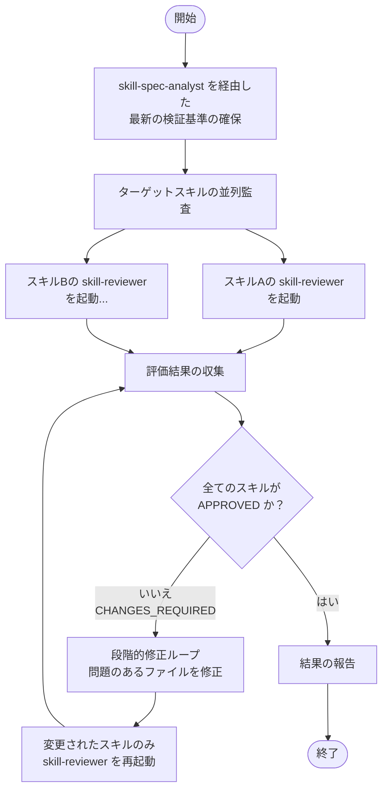

# validating-skills

このスキルは、このリポジトリ内の1つ以上のスキルが Agent Skills オープンスタンダード、リポジトリのコンテキスト分離ルール、および実行の安全性に準拠しているかを検証する際に使用します。

## 主な機能
- Agent Skills の公式標準ドキュメントから検証基準（Validation Axes）を動的に抽出し、キャッシュを更新します。
- 専用の `skill-reviewer` サブエージェントを使用して、指定されたターゲットスキルを並列で監査します。
- 全てのターゲットスキルが `APPROVED`（承認済み）の評価を得るまで、段階的な修正ループを強制します。

## 関連サブエージェント
- **`skill-spec-analyst`**: 最新の公式標準ドキュメントを自律的に解釈し、必要な検証基準を策定するサブエージェントです。
- **`skill-reviewer`**: 策定された基準に基づき、作成または変更されたスキルを客観的に監査するサブエージェントです。

## ワークフロー

以下の図は、このスキルを使用して他のスキルの妥当性を検証する際の処理のフロー（振る舞い）を表しています。

### ワークフローの解説
1. **検証基準の最新化**: `skill-spec-analyst` サブエージェントを呼び出し、Agent Skills の公式標準ドキュメントから最新の検証基準（Validation Axes）を動的に抽出してキャッシュを更新します。
2. **並列監査の実行**: 指定された各ターゲットスキルに対して、専用の `skill-reviewer` サブエージェントを並列（パラレル）で立ち上げ、それぞれ監査を実行させます。
3. **評価結果の収集**: 各サブエージェントからの監査レポートを収集し、評価が `APPROVED` か `CHANGES_REQUIRED` かを判定します。
4. **段階的修正ループ**: もし `CHANGES_REQUIRED` と判定されたスキルがある場合、指摘事項に従って対象ファイルを修正します。その後、**修正されたスキルのみ**を対象として再度 `skill-reviewer` を実行し、全スキルが `APPROVED` になるまで繰り返します。
5. **結果の報告**: 全てのスキルが `APPROVED` となった時点で、最終的な監査サマリーをユーザーに報告します。
