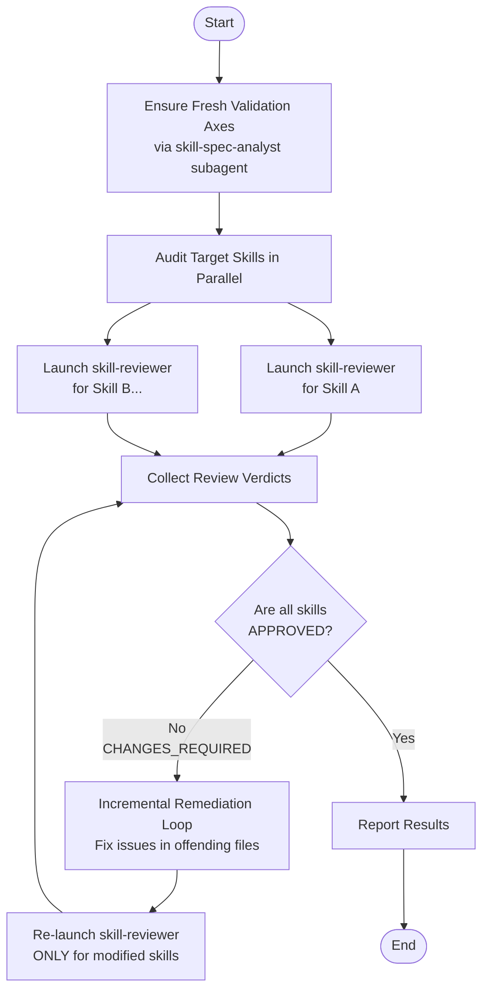

# validating-skills

Use this skill when verifying one or more skills in this repository for compliance with Agent Skills open standards, repository context isolation rules, and execution safety.

## Features
- Dynamically extracts and caches validation criteria (Validation Axes) from the official Agent Skills standards.
- Audits target skills in parallel using dedicated `skill-reviewer` subagents.
- Enforces an incremental remediation loop until all target skills achieve an `APPROVED` verdict.

## Related Subagents
- **`skill-spec-analyst`**: A subagent that autonomously interprets the latest official primary documentation to formulate the necessary validation axes.
- **`skill-reviewer`**: A subagent that objectively audits created or modified skills based on the formulated axes.

## Workflow

The following diagram illustrates the workflow and behavior when using this skill to validate other skills.

### Workflow Explanation
1. **Ensure Fresh Validation Axes**: Invokes the `skill-spec-analyst` subagent to dynamically extract and cache the latest validation criteria (Validation Axes) from the official Agent Skills standards.
2. **Audit Target Skills in Parallel**: Launches dedicated `skill-reviewer` subagents in parallel to audit each specified target skill.
3. **Collect Review Verdicts**: Collects the audit reports from the subagents and checks if the skills received an `APPROVED` or `CHANGES_REQUIRED` verdict.
4. **Incremental Remediation Loop**: If any skill receives `CHANGES_REQUIRED`, instructs the agent to fix the identified issues in the offending files, then re-launches the `skill-reviewer` subagent *only* for the modified skills.
5. **Report Results**: Once all target skills achieve an `APPROVED` verdict, reports the final aggregated audit summary to the user.
