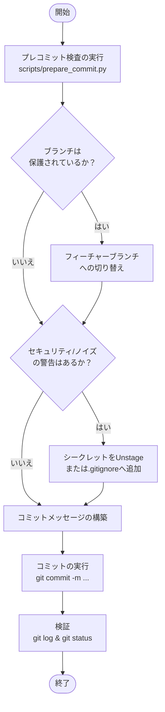

# committing-changes

Git コミットの準備、フォーマット、実行を行う際に使用するスキルです。手作業の負担を減らしつつ、高品質なコミットを維持します。

## 主な機能
- ヘルパースクリプト（`scripts/prepare_commit.py`）を通じて自動プレコミットチェック（ブランチの安全性、シークレット検出、ステージングされた差分の分析）を実行します。
- モデル固有の Co-authored-by 属性を付与したコンテキスト豊かな Conventional Commits を構築します。

## ワークフロー

以下の図は、このスキルを使用する際の処理のフロー（振る舞い）を表しています。

### ワークフローの解説
1. **Pre-Commit Inspection (事前検査)**: `prepare_commit.py` を実行し、現在のブランチの保護状態、誤ってステージングされた機密情報（シークレット）や不要なファイル、アトミックなコミット範囲かどうかを検査します。
2. **安全性の確保と修正**: ブランチが保護されている場合はフィーチャーブランチを作成して切り替えます。機密情報などが検出された場合は、コミット対象から外す（Unstage）か `.gitignore` に追加して安全を確保します。
3. **コミットメッセージの構築**: Conventional Commits（規約に基づくコミット）の形式に従い、プレフィックス（`feat`, `fix` など）、わかりやすい概要、変更の理由（コンテキスト）を含む本文、さらにAIエージェントの Co-Authored-By 署名を追加したメッセージを生成します。
4. **コミットの実行と検証**: 構築したメッセージを使用して Git コミットを実行し、最後に `git log` と `git status` を確認して正しくコミットが完了したかを検証します。
