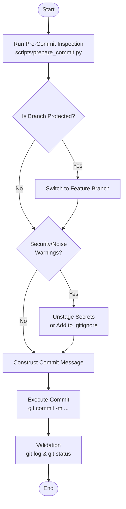

# committing-changes

Use this skill when preparing, formatting, and executing Git commits. It ensures your commits adhere to high standards without manual toil.

## Features
- Runs automated pre-commit checks (branch safety, secret detection, staging diff analysis) via a helper script (`scripts/prepare_commit.py`).
- Constructs context-rich Conventional Commits with model-specific co-author attribution.

## Workflow

The following diagram illustrates the workflow and behavior when using this skill.

### Workflow Explanation
1. **Pre-Commit Inspection**: Runs `prepare_commit.py` to inspect branch protection rules, detect mistakenly staged secrets or noise files, and evaluate the atomic scope of the commit.
2. **Handle Safety and Warnings**: Switches to a feature branch if the current branch is protected. Unstages secrets or adds noise files to `.gitignore` if security or noise warnings are triggered.
3. **Construct Commit Message**: Constructs a commit message following the Conventional Commits specification, including a context-rich body explaining the "why", and a model-specific `Co-Authored-By` trailer.
4. **Execute Commit and Validation**: Executes the Git commit with the constructed message, and runs `git log` and `git status` to verify the commit succeeded and the working tree is clean.
