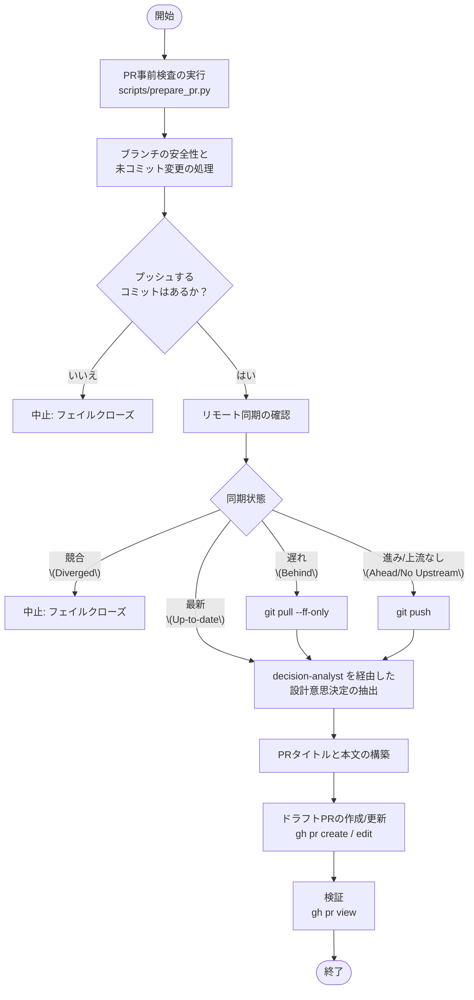

# drafting-pull-request

GitHub 上で新しいドラフトプルリクエストを作成したり、既存の PR を更新したりする際に使用するスキルです。

## 主な機能
- `scripts/prepare_pr.py` を用いて、リポジトリの状態、未コミットの変更、ブランチの安全性、リモート同期を検査します。
- ローカライズされた折りたたみ（Folding）を含む `release-please` 互換の PR をフォーマットします。
- `decision-analyst` サブエージェントと連携し、客観的な設計決定やトレードオフを抽出します。

## 関連サブエージェント
- **`decision-analyst`**: セッションログとコード差分を分析し、客観的で価値の高い設計決定やアーキテクチャ上のトレードオフを抽出することに特化した、ソフトウェアアーキテクト専門のサブエージェントです。バグやハルシネーション、自明な選択を厳密にフィルタリングします。

## ワークフロー

以下の図は、このスキルを使用してプルリクエスト（PR）を作成または更新する際の処理のフロー（振る舞い）を表しています。

### ワークフローの解説
1. **Pre-PR Inspection (事前検査)**: `prepare_pr.py` を実行して、リポジトリの状態、現在のブランチの安全性、未コミットの変更、リモートブランチとの同期状態、既に PR が存在するかどうかを診断します。
2. **安全性の確保と未コミット変更の処理**: 現在のブランチが保護されている場合は新しい作業ブランチを作成します。作業中の未コミット変更がある場合は、安全にコミット（`committing-changes` スキルを活用）します。もし新しいコミットが1つも存在しない場合は、安全のため処理を中止（Fail-Closed）します。
3. **リモート同期 (Sync)**: ローカルとリモートのブランチ状態を比較し、必要に応じてプッシュ（Push）やプル（Pull --ff-only）を行い同期します。競合（Diverged）状態の場合は安全のため処理を中止します。
4. **設計意思決定の抽出**: 専用サブエージェント `decision-analyst` を呼び出し、実装の背景にある重要な設計上の決定やトレードオフを分析・抽出します。
5. **PR内容の構築**: `release-please` と互換性のあるタイトルと、抽出された設計上の決定事項を含む構造化された PR 本文を生成します。ユーザーの言語設定に応じて、翻訳内容を折りたたみ（`
`）で追加します。
6. **PRの作成・更新**: GitHub CLI (`gh`) を使用して、新しいドラフト PR の作成、または既存の PR の内容更新を行います。
7. **検証 (Validation)**: `gh pr view` を用いて、作成・更新された PR が正しい状態（Draft かつ正しいタイトル等）であることを確認します。
