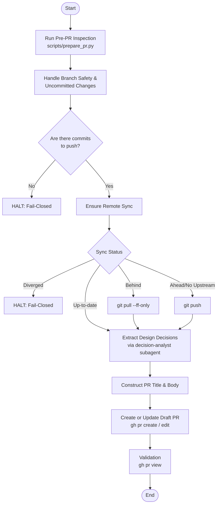

# drafting-pull-request

Use this skill when creating a new draft pull request or updating an existing PR on GitHub.

## Features
- Inspects repository state, uncommitted changes, branch safety, and remote sync using `scripts/prepare_pr.py`.
- Formats `release-please` compatible PRs with localized folding.
- Integrates with the `decision-analyst` subagent to extract objective design decisions and trade-offs.

## Related Subagents
- **`decision-analyst`**: A dedicated software architect expert specialized in analyzing session logs and diffs to extract objective, high-value design decisions and architectural trade-offs while strictly filtering out bugs, hallucinations, and obvious choices.

## Workflow

The following diagram illustrates the workflow and behavior for creating or updating a pull request using this skill.

### Workflow Explanation
1. **Pre-PR Inspection**: Runs `prepare_pr.py` to diagnose repository metadata, branch safety, uncommitted changes, remote sync status, and existing PR status.
2. **Handle Branch Safety & Uncommitted Changes**: Switches to a feature branch if the current branch is protected. Safely commits any working tree changes (using the `committing-changes` skill). Halts execution if there are zero commits to push.
3. **Ensure Remote Synchronization**: Synchronizes local commits with the remote repository by pushing or pulling (`--ff-only`) based on the sync status. Halts safely if the branch is diverged.
4. **Extract Design Decisions**: Invokes the `decision-analyst` subagent to extract high-value design decisions and architectural trade-offs from the session context.
5. **Construct PR Title & Body**: Formats a `release-please` compatible PR title and a structured PR body incorporating the extracted design decisions. Appends a localized folding section for non-English conversation contexts.
6. **Create or Update PR**: Uses the GitHub CLI (`gh`) to create a new draft PR or update an existing open PR.
7. **Validation**: Verifies the PR creation or update by running `gh pr view`.
