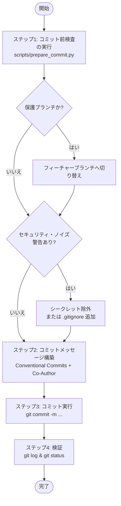

# コミット実行スキル (`committing-changes`)

Git バージョン管理におけるコミット前自動安全検査および Conventional Commits 作成スキルです。

---

## 1. 概要と目的

エージェント主導のソフトウェア開発において、指針なしに Git コミットを実行すると、保護ブランチの汚染、機密ファイル（API キー、認証情報、ローカル設定等）の誤コミット、ビルドノイズの混入、および内容の乏しい不透明なコミットメッセージの量産を引き起こします。

`committing-changes` スキルは、ステージングされた変更を監査し、ブランチ保護を強制し、自動で共同作成者（Co-Author）情報を付与したコンテキスト豊かな Conventional Commit を作成する決定論的かつ安全優先（Fail-Closed）のワークフローを提供します：

1. **コミット前の安全性検証**: 自動検査スクリプトを実行して作業ブランチの安全性を確認し、機密ファイルやノイズの混入を防止。
2. **コンテキスト豊かな Conventional Commits**: 対話コンテキストに基づき、変更の「理由（Why）」と「内容（What）」を明確に説明する標準化メッセージを生成。
3. **実行エージェントを認識した Co-Author 表記**: 実行中のエージェントおよびモデルに応じた標準 `Co-Authored-By` トレーラーを自動付加。

---

## 2. アーキテクチャの柱とコア標準

| アーキテクチャの柱 | 準拠標準・仕様 | 主な責務 |
| :--- | :--- | :--- |
| **Conventional Commits** | **Conventional Commits 1.0.0** | 正しいコミット種別（`feat`, `fix`, `docs`, `refactor`, `test`, `chore`）、任意のスコープ、命令形の簡潔な件名、および詳細な説明本文を構築。 |
| **安全性とシークレット防止** | **Fail-Closed 検査スクリプト** | ブランチ安全性（保護ブランチへのコミット防止）、機密ファイル（`.env`, 証明書, 秘密鍵）のステージング検知・遮断、および OS / ビルドノイズの警告。 |
| **共同作成者情報 (Co-Author)** | **Git Co-Author プロトコル** | ペアプログラミングの出所追跡を担保するため、`Co-Authored-By: <AgentName> <ModelName> <<email>>` トレーラーを付与。 |

---

## 3. ツールとサブエージェントアーキテクチャ

本スキルは、サードパーティ製パッケージに依存せず、あらゆるエージェント実行環境で即座に動作する標準ライブラリのみで書かれた Python 検査スクリプトを活用します：

```text
plugins/swe-workflow/skills/committing-changes/
├── SKILL.md                 # 決定論的な実行プロトコル
├── README.md                # 英語ドキュメント（SSOT）
├── README.ja.md             # 日本語派生ドキュメント
├── evals/evals.json         # スキル評価スイート
└── scripts/
    └── prepare_commit.py    # コミット前検査スクリプト (PEP 723)
```

### `prepare_commit.py` スクリプトの機能
- **保護ブランチ検知**: デフォルトブランチ（`main`, `master`）やリリースブランチ（`release*`）を検出し、フィーチャーブランチへの切り替えを案内。
- **機密ファイルスキャナ**: ステージングされたファイルパスを一般的なシークレットパターン（`.env`, `id_rsa`, `.pem`, `credentials.json` 等）と照合。
- **差分およびステージング分析**: `git status -s` および `git diff --staged` を解析し、アトミックコミットのスコープを要約。
- **JSON 出力モード**: 機械可読なレポート出力に対応する `--json` オプションを提供。

---

## 4. シーケンシャルワークフロープロトコル



1. **ステップ1: コミット前検査**: `python3 scripts/prepare_commit.py` を実行し、リポジトリのブランチ状態、ステージング差分、機密ファイル警告を診断。
2. **ステップ2: ブランチ安全性と警告の解消**: 保護ブランチにいる場合はフィーチャーブランチへ切り替え、警告がある場合は機密ファイルのアンステージや `.gitignore` への追記を実施。
3. **ステップ3: Conventional Commit の構築**: 変更の技術的根拠（Why）を説明する構造化メッセージと Co-Author 情報を組み立て。
4. **ステップ4: コミット実行と検証**: `git commit` を実行し、`git log -n 1` および `git status` でコミットの成立とクリーンな作業ツリーを確認。

---

## 5. 生成成果物と検証

```bash
# 最新コミットのメッセージおよび作成者情報の確認
git log -n 1

# 作業ツリーがクリーンであることの確認
git status
```
