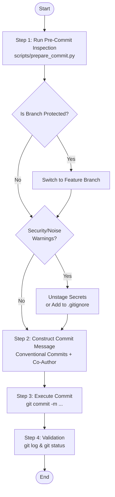

# Commit Changes Skill (`committing-changes`)

Automated pre-commit inspection and Conventional Commit authoring skill for Git version control.

---

## 1. Overview & Objectives

In agentic software engineering, unguided Git commits frequently introduce protected branch violations, accidental leakage of sensitive files (API keys, credentials, local settings), noise files, and vague or uninformative commit messages.

The `committing-changes` skill provides a deterministic, fail-closed workflow that audits staged changes, enforces branch protection, and constructs high-context Conventional Commits with automated co-author attribution:

1. **Pre-Commit Safety Verification**: Runs automated inspection to ensure working on safe feature branches and prevent staging sensitive tokens or noise files.
2. **Context-Rich Conventional Commits**: Generates standardized commit messages explaining the "Why" and "What" based on active conversation context.
3. **Model-Aware Co-Author Attribution**: Appends standardized `Co-Authored-By` trailers matching the active agent runtime.

---

## 2. Core Standards & Architectural Pillars

| Architectural Pillar | Core Standards & Specifications | Key Responsibilities |
| :--- | :--- | :--- |
| **Conventional Commits** | **Conventional Commits 1.0.0** | Formats commit messages with valid type (`feat`, `fix`, `docs`, `refactor`, `test`, `chore`), optional scope, clear imperative subject, and structured explanatory body. |
| **Safety & Secret Prevention** | **Fail-Closed Inspection Script** | Inspects branch safety (protected branch blocking), blocks staging of sensitive credentials (`.env`, certificates, private keys), and warns on OS/build noise. |
| **Co-Author Attribution** | **Git Co-Author Protocol** | Appends standardized `Co-Authored-By: <AgentName> <ModelName> <<email>>` trailer to preserve provenance in agentic pair programming. |

---

## 3. Tooling & Subagent Architecture

The skill relies on a standard-library Python inspection script designed for portability across agent environments without third-party package dependencies:

```text
plugins/swe-workflow/skills/committing-changes/
├── SKILL.md                 # Deterministic execution instructions
├── README.md                # English documentation (SSOT)
├── README.ja.md             # Japanese derived documentation
├── evals/evals.json         # Skill evaluation test cases
└── scripts/
    └── prepare_commit.py    # Pre-commit inspection helper script (PEP 723)
```

### `prepare_commit.py` Script Capabilities
- **Branch Protection Detection**: Identifies default (`main`, `master`) and protected branches (`release*`), guiding the agent to create a feature branch.
- **Sensitive File Scanner**: Scans staged file paths against common secret patterns (`.env`, `id_rsa`, `.pem`, `credentials.json`).
- **Diff & Staging Analysis**: Parses `git status -s` and `git diff --staged` to summarize atomic commit scope.
- **JSON Output Mode**: Supports `--json` flag for machine-readable inspection reports.

---

## 4. Sequential Workflow Protocol



1. **Step 1: Pre-Commit Inspection**: Executes `python3 scripts/prepare_commit.py` to inspect repository branch status, staged diff, and sensitive file warnings.
2. **Step 2: Handle Branch Safety & Warnings**: Switches to a feature branch if on a protected branch; unstages sensitive files or updates `.gitignore` if warnings exist.
3. **Step 3: Construct Conventional Commit**: Synthesizes a structured Conventional Commit message explaining the technical rationale ("Why") with co-author attribution.
4. **Step 4: Execute & Verify Commit**: Commits changes via `git commit` and verifies clean status via `git log -n 1` and `git status`.

---

## 5. Output Artifacts & Verification

```bash
# Verify the latest commit message and author attribution
git log -n 1

# Verify the working tree status is clean
git status
```
