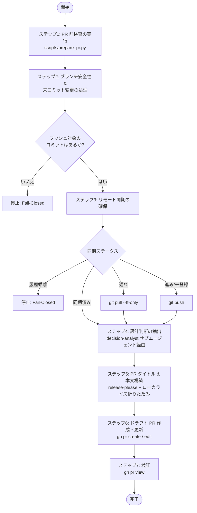

# プルリクエスト作成スキル (`drafting-pull-request`)

リポジトリ状態の自動検査、設計判断の客観的抽出、および GitHub プルリクエスト（PR: Pull Request）作成スキルです。

---

## 1. 概要と目的

エージェント主導のソフトウェア開発において、事前検証を行わずにプルリクエストを作成すると、プッシュ漏れのコミット、リモートとの不整合、未追跡の変更、またはレビュアーに生の差分から設計意図を逆算させるような質の低い説明文の量産を招きます。

`drafting-pull-request` スキルは、リポジトリの同期状態を監査し、`decision-analyst` サブエージェントにより熟慮されたアーキテクチャ上のトレードオフを抽出し、2 言語の折りたたみ詳細を備えた release-please 互換の GitHub ドラフト PR を作成する自動化された安全優先（Fail-Closed）のワークフローを提供します：

1. **PR 作成前のリポジトリ検査**: 提出前にリモート同期状態、未コミット変更、ブランチ安全性、および既存のオープン PR を診断。
2. **アーキテクチャ設計判断の抽出**: `decision-analyst` サブエージェントを呼び出し、単なるバグ修正や自明な手順から真の設計判断・トレードオフを厳密に分離。
3. **リリース自動化に対応した PR 記述**: Conventional Commit 準拠のタイトル（`release-please` 互換）と、対話言語に応じたローカライズ折りたたみ（`<details>`）を構築。
4. **Stacked PR への対応**: `gh-stack` が導入されている環境下での段階的なブランチ結合を支援。

---

## 2. アーキテクチャの柱とコア標準

| アーキテクチャの柱 | 準拠標準・仕様 | 主な責務 |
| :--- | :--- | :--- |
| **リリース自動化** | **`release-please` 互換性** | マージ時にセマンティックバージョニングとチェンジログ自動生成を駆動するため、Conventional Commit 準拠の PR タイトル（`<type>(<scope>): <subject>`）を強制。 |
| **設計の透明性** | **`decision-analyst` サブエージェント** | セッションログと差分を分析し、採用アプローチ、検討された代替案、および明示的なトレードオフを記録。 |
| **Fail-Closed 検査** | **安全な同期プロトコル** | 未分類の未コミット変更、ベースブランチに対する差分コミット 0 件、またはリモートとの履歴乖離（Diverged）を検知して安全に停止。 |
| **動的ローカライゼーション** | **バイリンガル PR 折りたたみ** | 構造化された英語説明文を提供しつつ、非英語の対話コンテキスト向けに動的派生した言語説明を折りたたみ（`<details>`）で付加。 |

---

## 3. ツールとサブエージェントアーキテクチャ

本スキルは、標準ライブラリの Python 検査スクリプトと専任のソフトウェアアーキテクト・サブエージェントを統合して動作します：

```text
plugins/swe-workflow/skills/drafting-pull-request/
├── SKILL.md                 # 決定論的な実行プロトコル
├── README.md                # 英語ドキュメント（SSOT）
├── README.ja.md             # 日本語派生ドキュメント
├── evals/evals.json         # スキル評価スイート
├── references/
│   └── pr-template.md       # 標準 PR 説明文マークダウンテンプレート
└── scripts/
    └── prepare_pr.py        # PR 前検査スクリプト (PEP 723)
```

### 構成要素の責務
- **`prepare_pr.py`**: リポジトリ NWO（`owner/repo`）、デフォルトブランチ、保護状態、未コミット変更、プッシュ / プル同期状態、既存 PR メタデータを診断。
- **`decision-analyst` サブエージェント**: 対話コンテキストと Git 差分を監査し、バグ修正や自明な選択を排除して客観的な設計判断・トレードオフを抽出。

---

## 4. シーケンシャルワークフロープロトコル



1. **ステップ1: PR 前検査**: `prepare_pr.py` を実行し、リポジトリメタデータ、ブランチ安全性、未コミット変更、同期ステータス、既存 PR を診断。
2. **ステップ2: ブランチ安全性と未コミット変更の処理**: フィーチャーブランチの安全性を確保し、作業ツリーの変更を `committing-changes` でコミット。コミット 0 件の場合は安全に停止。
3. **ステップ3: リモート同期の確保**: プッシュまたは fast-forward プルによってリモート追跡ブランチと同期。乖離時は安全に停止。
4. **ステップ4: 設計判断の抽出**: `decision-analyst` を呼び出し、客観的な設計判断とトレードオフを抽出。
5. **ステップ5: PR タイトルおよび本文の構築**: `release-please` 互換のタイトル、構造化された英語本文、およびローカライズ折りたたみ詳細を合成。
6. **ステップ6: PR の作成または更新**: GitHub CLI（`gh`）を使用してドラフト PR を新規作成（または既存のオープン PR を更新）。
7. **ステップ7: 検証**: `gh pr view` で PR の状態を確認し、URL をユーザーへ報告。

---

## 5. 生成成果物と検証

```bash
# GitHub 上の PR ステータス、タイトル、ドラフト状態の確認
gh pr view --json number,title,url,isDraft,state
```
