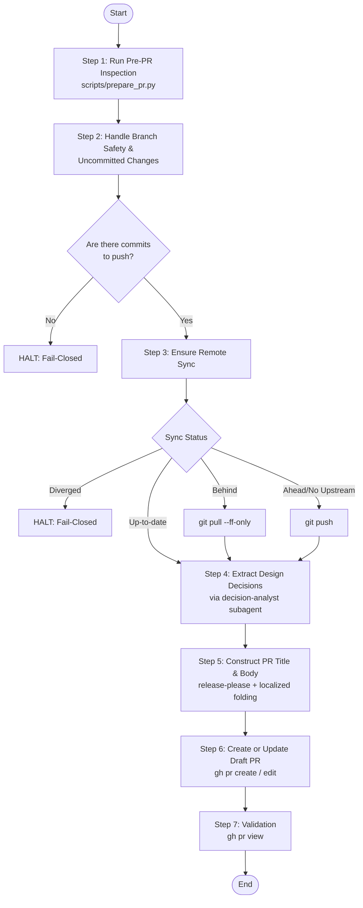

# Drafting Pull Request Skill (`drafting-pull-request`)

Automated repository inspection, design decision extraction, and GitHub Pull Request creation skill.

---

## 1. Overview & Objectives

In agentic software development, submitting uninspected pull requests frequently results in unpushed commits, desynchronized remotes, untracked changes, or low-quality descriptions that force human reviewers to reverse-engineer architectural intent from raw diffs.

The `drafting-pull-request` skill provides an automated, fail-closed workflow that audits repository synchronization, extracts deliberate architectural trade-offs via the `decision-analyst` subagent, and formats release-please compatible GitHub Draft Pull Requests with bilingual detail blocks:

1. **Pre-PR Repository Inspection**: Evaluates remote sync status, uncommitted changes, branch safety, and existing open PRs before submission.
2. **Architectural Decision Extraction**: Dispatches the `decision-analyst` subagent to isolate genuine design decisions and trade-offs from bugs and trivial choices.
3. **Release-Ready PR Descriptions**: Formats Conventional Commit titles (`release-please` compatible) and localized folding sections (`<details>`) matching the active conversation language.
4. **Stacked PR Compatibility**: Supports linking stacked feature branches via `gh-stack` where installed.

---

## 2. Core Standards & Architectural Pillars

| Architectural Pillar | Core Standards & Specifications | Key Responsibilities |
| :--- | :--- | :--- |
| **Release Automation** | **`release-please` Compatibility** | Enforces Conventional Commit PR titles (`<type>(<scope>): <subject>`) to drive automated semantic versioning and changelog generation upon merge. |
| **Architectural Transparency** | **`decision-analyst` Subagent** | Evaluates session context and diffs to document chosen solutions, considered alternatives, and explicit trade-offs. |
| **Fail-Closed Inspection** | **Safe Synchronization Protocol** | Halts on unclassified uncommitted changes, zero diff commits against base, or diverged remote states. |
| **Dynamic Localization** | **Bilingual PR Folding** | Provides structured English descriptions while dynamically appending folded localized explanations (`<details>`) for non-English conversation contexts. |

---

## 3. Tooling & Subagent Architecture

The skill integrates a standard-library Python inspection script and a specialized software architect subagent:

```text
plugins/swe-workflow/skills/drafting-pull-request/
├── SKILL.md                 # Deterministic execution instructions
├── README.md                # English documentation (SSOT)
├── README.ja.md             # Japanese derived documentation
├── evals/evals.json         # Skill evaluation test cases
├── references/
│   └── pr-template.md       # Standard PR description markdown template
└── scripts/
    └── prepare_pr.py        # Pre-PR inspection helper script (PEP 723)
```

### Supporting Components
- **`prepare_pr.py`**: Diagnoses repository NWO, default base branch, protection status, uncommitted working tree items, push/pull sync status, and existing PR metadata.
- **`decision-analyst` Subagent**: Analyzes conversational context and git diff to extract non-trivial architectural trade-offs while filtering out bug fixes and obvious steps.

---

## 4. Sequential Workflow Protocol



1. **Step 1: Pre-PR Inspection**: Runs `prepare_pr.py` to diagnose repository metadata, branch safety, uncommitted changes, remote sync status, and existing PRs.
2. **Step 2: Handle Branch Safety & Uncommitted Changes**: Ensures feature branch safety, commits active changes via `committing-changes`, and halts safely if zero commits exist.
3. **Step 3: Ensure Remote Synchronization**: Synchronizes local commits with the remote tracking branch via push or fast-forward pull; halts safely on diverged branches.
4. **Step 4: Extract Design Decisions**: Dispatches `decision-analyst` to formulate objective design decisions and trade-offs.
5. **Step 5: Construct PR Title & Body**: Synthesizes a `release-please` compatible title, structured English body, and localized folding details.
6. **Step 6: Create or Update PR**: Creates a GitHub Draft PR (or updates an existing open PR) using the GitHub CLI (`gh`).
7. **Step 7: Validation**: Verifies the PR status via `gh pr view` and reports the URL to the user.

---

## 5. Output Artifacts & Verification

```bash
# Verify the PR status, title, and draft state on GitHub
gh pr view --json number,title,url,isDraft,state
```
