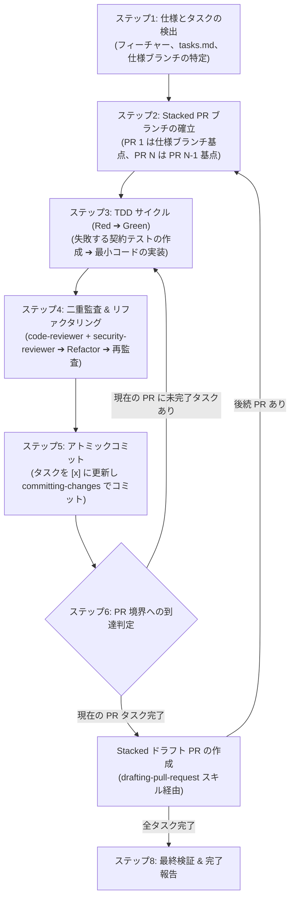

# タスク実装スキル (`implementing-tasks`)

Spec-Driven Development（SDD: 仕様駆動開発）の**実装フェーズ**を担当する包括的な実装エンジニアリングスキルです。

---

## 1. 概要と目的

エージェント主導のソフトウェア開発において、厳格な契約検証やテスト駆動の規約、客観的なセキュリティ監査を伴わずに機能を実装すると、脆弱なコード、リグレッションバグ、アサーションの骨抜き、およびアーキテクチャの劣化を招きます。

`implementing-tasks` スキルは、`docs/specs/<feature-name>/` 配下の仕様資産（`requirements.md`、`design.md`、`tasks.md`）を製品品質のソフトウェアへと具現化する、自動化された耐障害性の高いテスト駆動ワークフローを提供します：

1. **厳格なテスト駆動開発 (TDD)**: 基本設計書（`design.md`）に定義された契約による設計（DbC: 事前条件、事後条件、不変条件）に基づき、Red-Green-Refactor サイクルを推進。
2. **2 体のエージェントによる品質・セキュリティ二重ゲート**: 独立したレビュアーサブエージェント（`code-reviewer` および `security-reviewer`）を起動し、アサーションの骨抜き防止、クリーンなコメント記述、非推奨 API の排除、および OWASP 基準の堅牢化をリファクタリング前に検証。
3. **Stacked PR の段階的構築とアトミック進捗管理**: 仕様ブランチを起点とする段階的なフィーチャーブランチ（Stacked PR）を編成し、各コミットと同期して GitHub Flavored Markdown (GFM) チェックボックスステートマシンをアトミックに更新。
4. **仕様不備発生時の安全なリカバリプロトコル**: 実装中に仕様の矛盾や障害が検知された場合、作業を退避（`git stash`）して仕様ブランチで改訂を行い、非破壊的な `git merge` によって順次変更を反映するプロトコルを標準化。

---

## 2. アーキテクチャの柱とコア標準

| アーキテクチャの柱 | 準拠標準・手法 | 主な責務 |
| :--- | :--- | :--- |
| **テスト駆動開発 (TDD)** | **Red-Green-Refactor** + **DbC 契約検証** | プロダクトコードの実装（Green）前に失敗する契約テスト（Red）を作成し、フィクスチャやテーブル駆動テストを活用。Refactor フェーズでコードを整理・洗練。 |
| **コードレビュー監査** | **`code-reviewer` サブエージェント** | DbC 契約準拠、アサーションの骨抜き防止、自明なコードなぞり書きコメントの排除、言語仕様準拠の Doc コメント、仕様書番号に依存しない自己完結した可読性、非推奨 API の排除、およびデータ集合の可読性ある改行と自動整形保護（フォーマッタ除外ディレクティブ）を監査。 |
| **セキュリティ監査** | **`security-reviewer` サブエージェント** | 入力検証、各種インジェクション脆弱性（SQL、コマンド、パストラバーサル）、シークレット漏洩防止、安全な暗号プリミティブ、およびリソースライフサイクル管理を監査。 |
| **Stacked PR アーキテクチャ** | **GitHub Stacked Branches** + **アトミックコミット** | 仕様ブランチを基点として実装ブランチを順次スタック（`spec` ➔ `PR-1` ➔ `PR-2`）し、`tasks.md` の更新と一体となったアトミックコミットを作成。 |
| **仕様不備リカバリ** | **非破壊的マージ伝播 (Merge Propagation)** | 作業中の変更を安全に退避し、仕様ブランチで `planning-and-designing` による仕様改訂を実施後、破壊的な rebase を避けて `git merge` で順次スタックブランチへ安全に反映。 |

---

## 3. サブエージェントとレビューアーキテクチャ

確証バイアスを排除し、コンテキストウィンドウの汚染を防ぐため、コード品質とセキュリティの評価は独立したコンテキストウィンドウで実行される専任のレビュアーサブエージェントに委譲されます：

```text
plugins/swe-workflow/agents/
├── code-reviewer.md         # コード品質 & DbC 契約準拠性の専任監査エージェント
└── security-reviewer.md     # アプリケーションセキュリティ & 脆弱性の専任監査エージェント
```

### レビュー収束プロトコル
1. **並行実行**: 実装およびテストの差分に対して、両サブエージェントが並行して監査を開始。
2. **Fail-Closed ゲート**: いずれかのレビュアーが `CHANGES_REQUIRED`（要修正）を発行した場合、主エージェントは指摘事項をすべて解消して再監査を実施。
3. **反復制限**: 1 タスクあたりの監査ループは最大 3 イテレーションに制限。未解決の重大課題は安全にユーザーへエスカレーション。
4. **リファクタリング検証**: 初回承認（Approved）獲得後、コードの整理・リファクタリングを実施し、最終的な再監査で品質劣化やリグレッションがないことを確認。

---

## 4. シーケンシャルワークフロープロトコル



1. **ステップ1: 仕様とタスクの検出**: 対象フィーチャーを特定し、`requirements.md`、`design.md`、`tasks.md` の存在を確認後、最初の未完了タスク（`- [ ]`）を特定。
2. **ステップ2: Stacked PR ブランチの確立**: 該当タスクが属するフィーチャーブランチを作成または切り替え（`PR-1` は仕様ブランチ基点、`PR-N` は `PR-N-1` 基点）。
3. **ステップ3: TDD 実装サイクル**: DbC 契約とデータ集合を検証する失敗テストを作成（Red）し、非推奨 API を排除した最新構文でテストをパスさせる最小コードを実装（Green）。
4. **ステップ4: 二重監査 & リファクタリング**: `code-reviewer` と `security-reviewer` による初回監査（Audit 1）➔ コードを整理するリファクタリング ➔ 最終再監査（Audit 2）。
5. **ステップ5: アトミックコミット**: `tasks.md` のチェックボックス（`- [x]`）を更新し、`committing-changes` スキルでアトミックな Conventional Commit を作成。
6. **ステップ6: PR 境界判定 & Stacked ドラフト PR 作成**: PR 境界に到達した段階でドラフト PR を提出し、次のスタックへ進行。
7. **ステップ7: 仕様不備時の退避・仕様改訂・マージ反映プロトコル**: 仕様の矛盾等を検知した場合、作業を退避（`git stash`）し、上流仕様を改訂後、`git merge` で順次スタックブランチへ安全に反映。
8. **ステップ8: 最終検証 & 完了報告**: 全タスク完了とテスト全件パスを確認し、ドラフト PR リンクをユーザーへ報告。

---

## 5. 生成成果物とブランチ構造

```text
git リポジトリ:
├── <spec-branch>                             # 承認済みの docs/specs/ を含むベースブランチ
│   └── docs/specs/<feature-name>/
│       ├── requirements.md
│       ├── design.md
│       └── tasks.md (アトミックに同期更新)
│
├── feat/<feature-name>-part-1                # 最初の一連のタスクを含む Stacked PR (ベース: <spec-branch>)
│   ├── src/... (実装コード)
│   └── tests/... (契約テストおよび単体テスト)
│
└── feat/<feature-name>-part-2                # 後続のタスクを含む Stacked PR (ベース: feat/...-part-1)
    ├── src/...
    └── tests/...
```

