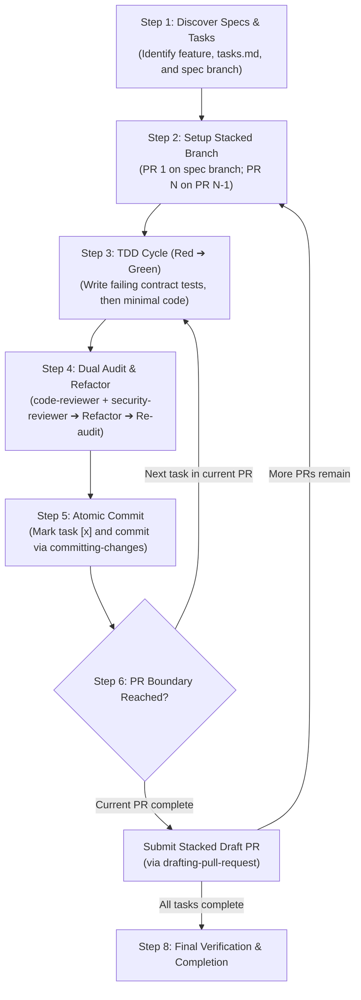

# Implementing Tasks Skill (`implementing-tasks`)

Comprehensive implementation engineering skill for the **implementation phase** of **Spec-Driven Development (SDD)**.

---

## 1. Overview & Objectives

In agentic software development, implementing features without strict contract verification, automated test-first discipline, or objective security oversight leads to brittle code, regressive bugs, weakened assertions, and architectural decay.

The `implementing-tasks` skill provides an automated, crash-resilient, and test-driven workflow that turns specifications (`requirements.md`, `design.md`, `tasks.md`) under `docs/specs/<feature-name>/` into production-grade software:

1. **Strict Test-Driven Development (TDD)**: Drives the Red-Green-Refactor cycle grounded in Design by Contract (DbC) preconditions, postconditions, and invariants.
2. **Dual-Agent Quality & Security Gate**: Dispatches isolated reviewer subagents (`code-reviewer` and `security-reviewer`) to enforce anti-weakened assertions, clean commenting, zero deprecated APIs, and OWASP defense-in-depth before refactoring.
3. **Stacked PR Execution & Atomic Tracking**: Organizes implementation into progressive, stacked feature branches starting directly on the specification branch, updating the GFM checkbox state machine atomically alongside each commit.
4. **Resilient Specification Gap Recovery**: Provides a standardized stash, upstream specification revision, and sequential merge protocol whenever specification inconsistencies or implementation blockers emerge.

---

## 2. Architectural Pillars & Core Standards

| Architectural Pillar | Core Standards & Methodologies | Key Responsibilities |
| :--- | :--- | :--- |
| **Test-Driven Development (TDD)** | **Red-Green-Refactor** + **DbC Verification** | Writes failing contract tests (Red) before writing production code (Green), leveraging fixtures and table-driven tests; cleans and streamlines code during the Refactor phase. |
| **Code Review Audit** | **`code-reviewer` Subagent** | Audits DbC alignment, prevents assertion weakening, eliminates trivial line-by-line comment narration, verifies language-standard Doc comments, enforces self-contained readability without spec IDs, eliminates deprecated APIs, and validates collection formatting and formatter protection. |
| **Security Audit** | **`security-reviewer` Subagent** | Audits input validation, injection vectors (SQL, command, path traversal), secret leakage prevention, safe cryptographic primitives, and resource lifecycle management. |
| **Stacked PR Architecture** | **GitHub Stacked Branches** + **Atomic Commits** | Stacks implementation branches sequentially starting on the specification branch (`spec` ➔ `PR-1` ➔ `PR-2`), committing atomically alongside `tasks.md` updates. |
| **Spec Defect Protocol** | **Non-Destructive Merge Propagation** | Safely stashes in-flight work, checks out the spec branch to execute revisions via `planning-and-designing`, and sequentially merges updates into stacked branches without destructive rebases. |

---

## 3. Subagents & Review Architecture

To eliminate confirmation bias and prevent context window pollution, all code quality and security evaluations are delegated to specialized reviewer subagents invoked in isolated context windows:

```text
plugins/swe-workflow/agents/
├── code-reviewer.md         # Dedicated code review & DbC contract compliance auditor
└── security-reviewer.md     # Dedicated application security & vulnerability auditor
```

### Review Convergence Protocol
1. **Parallel Execution**: Both subagents are launched concurrently against the implementation and test diff.
2. **Fail-Closed Gate**: If either reviewer issues a `CHANGES_REQUIRED` verdict, the primary agent addresses all listed defects and re-audits.
3. **Bounded Iterations**: Audits are restricted to a maximum of 3 iterations per task. Unresolved blockers are safely escalated to the user.
4. **Refactor Verification**: Once initial approval is achieved, the primary agent executes a refactoring pass to streamline the code, followed by a final re-audit to verify that no code smells or regressions were introduced.

---

## 4. Sequential Workflow Protocol



1. **Step 1: Specification & Task Discovery**: Identifies target feature, verifies existence of `requirements.md`, `design.md`, and `tasks.md`, and finds the first uncompleted task (`- [ ]`).
2. **Step 2: Stacked PR Branch Setup**: Creates or switches to the designated feature branch (`PR-1` based on spec branch; `PR-N` based on `PR-N-1`).
3. **Step 3: TDD Implementation Cycle**: Writes failing unit/contract tests verifying DbC rules and data collections (Red), then writes minimal production code using modern non-deprecated APIs to pass the tests (Green).
4. **Step 4: Dual Audit & Refactor Phase**: Audits diff via `code-reviewer` and `security-reviewer` (Audit 1), refactors for simplicity, and conducts final re-audit (Audit 2).
5. **Step 5: Atomic Progress Commit**: Updates `tasks.md` checkbox (`- [x]`) and creates an atomic Conventional Commit via `committing-changes`.
6. **Step 6: PR Boundary & Stacked PR Submission**: Submits Stacked Draft PRs upon completing PR task boundaries and advances to the next stack.
7. **Step 7: Specification Defect Stash & Merge Protocol**: If specification inconsistencies emerge, stashes work, executes upstream spec revisions, and sequentially merges updates into stacked branches.
8. **Step 8: Final Verification & Completion**: Confirms all tasks and test suites pass and reports draft PR links to the user.

---

## 5. Generated Artifacts & Branching Structure

```text
git repository:
├── <spec-branch>                             # Base branch containing approved docs/specs/
│   └── docs/specs/<feature-name>/
│       ├── requirements.md
│       ├── design.md
│       └── tasks.md (updated atomically)
│
├── feat/<feature-name>-part-1                # First implementation Stacked PR (base: <spec-branch>)
│   ├── src/... (implementation code)
│   └── tests/... (contract and unit tests)
│
└── feat/<feature-name>-part-2                # Second implementation Stacked PR (base: feat/...-part-1)
    ├── src/...
    └── tests/...
```

