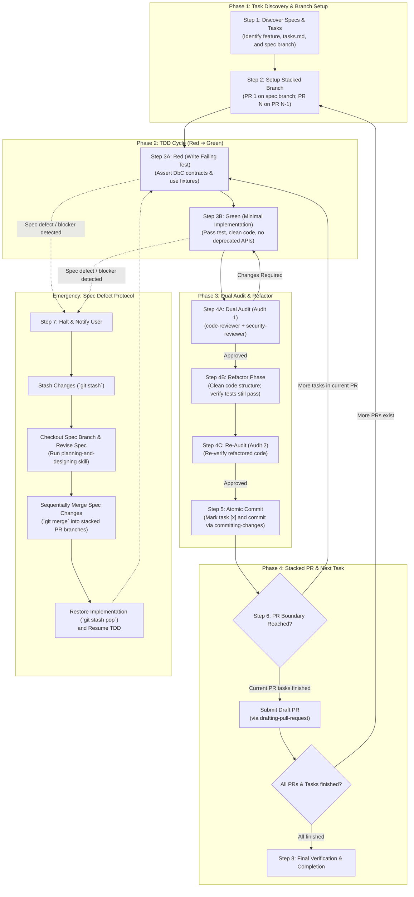

# Implementing Tasks (Spec-Driven Development)

This skill guides the end-to-end execution of the implementation phase of Spec-Driven Development (SDD). It reads task planning and design specifications from `docs/specs/<feature-name>/`, drives strict Test-Driven Development (TDD: Red-Green-Refactor) against component contracts (DbC), enforces isolated reviewer audits, maintains an atomic progress tracking state machine, and stacks Draft Pull Requests against the upstream specification branch.

---

## Workflow Protocol

Follow these sequential steps whenever executing implementation tasks:



---

### Step 1: Specification & Task Discovery

1. **Target Feature Identification**:
   - Determine `<feature-name>` from explicit user argument, current branch name (e.g. `feat/<feature-name>-...`), or by scanning `docs/specs/`.
   - Verify that `docs/specs/<feature-name>/tasks.md`, `design.md`, and `requirements.md` exist.
   - If specifications do not exist or are incomplete, **HALT safely (Fail-Closed)** and instruct the user to execute the `planning-and-designing` skill first.

2. **Locate Target Spec Branch & Next Task**:
   - Identify the canonical upstream specification branch (e.g. `feat/<feature-name>` or `specs/<feature-name>`).
   - Read `docs/specs/<feature-name>/tasks.md` and find the first uncompleted task checkbox (`- [ ]`).
   - Identify the PR group to which the task belongs (e.g. `PR-1`, `PR-2`) and the associated component (`COMP-xxx`) and requirements (`REQ-xxx`).

---

### Step 2: Stacked PR Branch Setup

Establish or switch to the correct feature branch according to the Stacked PR structure:

1. **Initial Implementation PR (`PR-1`)**:
   - Base branch: **Upstream specification branch** (the branch containing the approved `docs/specs/<feature-name>/`).
   - Create branch: `git checkout -b feat/<feature-name>-part-1 <spec-branch>` (or project-standard naming).
2. **Subsequent Stacked PRs (`PR-N`)**:
   - Base branch: **Preceding PR branch** (`feat/<feature-name>-part-<N-1>`).
   - Create branch: `git checkout -b feat/<feature-name>-part-<N> feat/<feature-name>-part-<N-1>`.
3. **Resumption**:
   - If already on the matching branch, ensure the working tree is clean and continue.

---

### Step 3: TDD Implementation Cycle (Red ➔ Green)

Execute strict Test-Driven Development for the current task (`TASK-xxx`):

1. **Step 3A: Red Phase (Failing Test)**:
   - Consult `design.md` for the relevant Component Contract (DbC: Preconditions, Postconditions, Invariants) and data models.
   - Write comprehensive unit/contract tests verifying expected behavior and boundary conditions.
   - **Test Fixture Best Practices**: Utilize framework fixtures (pytest fixtures, JUnit `@BeforeEach`, Test Data Builders) to eliminate boilerplate.
   - **Collection Formatting**: Format matrix/table datasets with readable indentation and line breaks, protecting them with formatter exclusion blocks (e.g. `// spotless:off` / `// spotless:on`, `# fmt: off` / `# fmt: on`, `// prettier-ignore`) if automated formatters are configured in the repository.
   - **Self-Contained Naming**: Do NOT use specification identifiers (`REQ-001`, `COMP-002`) in test names or assertions; use descriptive domain terminology.
   - Execute the test runner and verify that the new test **fails as expected** (Red).

2. **Step 3B: Green Phase (Minimal Implementation)**:
   - Write the minimal production code necessary to satisfy the test and adhere to the contract.
   - **Zero Deprecated APIs**: Ensure all invoked APIs, standard library functions, and third-party libraries use modern, non-deprecated alternatives.
   - **Doc Comments & Code Cleanliness**: Add language-standard Doc comments to public/abstract members. Omit obvious line-by-line narration comments; document only non-obvious reasoning.
   - Execute the test suite and verify that all tests **pass cleanly** (Green).

---

### Step 4: Dual Audit & Refactor Phase

1. **Step 4A: Dual Audit (Audit 1)**:
   - Concurrently invoke the dedicated `code-reviewer` and `security-reviewer` subagents to audit modified implementation and test files.
   - **code-reviewer**: Audits DbC alignment, anti-weakening of tests, fixture usage, comment discipline, Doc comments, spec-free readability, clean architecture, deprecated API elimination, and collection formatting.
   - **security-reviewer**: Audits input validation, secret leakage prevention, safe cryptography, and resource management.
   - **Convergence**:
     - If either reviewer returns `CHANGES_REQUIRED`, address all defects and re-audit (up to 3 total iterations, Fail-Closed).
     - Proceed only when both reviewers return **APPROVED**.

2. **Step 4B: Refactor Phase**:
   - Address any structural roughness or code bloat introduced during audit iteration.
   - Refactor production code and tests for maximum simplicity, maintainability, and clarity.
   - Re-run all tests to confirm they **continue to pass cleanly**.

3. **Step 4C: Re-Audit (Audit 2)**:
   - Re-invoke reviewers on the refactored diff to verify that no regressions or code smells were introduced.
   - Proceed only upon receiving **APPROVED**.

---

### Step 5: Atomic Progress Commit

1. **Update Execution State Machine**:
   - Update `docs/specs/<feature-name>/tasks.md`, toggling the completed task checkbox from `- [ ]` to `- [x]`.
2. **Execute Atomic Commit**:
   - Delegate to the `committing-changes` skill to inspect staging safety and generate an atomic Conventional Commit (e.g. `feat(<scope>): implement <task-description>`).
   - Ensure the modified code, tests, and updated `tasks.md` are committed together in a single atomic unit.

---

### Step 6: PR Boundary & Stacked PR Submission

1. **Check PR Completion**:
   - Check `tasks.md` to determine whether all tasks allocated to the current PR have been completed (`- [x]`).
   - If uncompleted tasks remain in the current PR, loop back to **Step 3** for the next task.
2. **Submit Stacked Draft PR**:
   - If all tasks for the current PR are complete, invoke the `drafting-pull-request` skill:
     - Push branch to remote.
     - Create a Draft PR targeting the designated base branch (Spec branch for `PR-1`; `PR-N-1` for `PR-N`).
     - Link stack via `gh stack link` if `gh-stack` is installed.
3. **Advance to Next Stacked PR**:
   - If subsequent PRs and tasks remain in `tasks.md`, loop back to **Step 2** to establish the next branch.

---

### Step 7: Specification Defect Stash & Merge Protocol

If a fundamental specification defect, logical contradiction, or insurmountable architectural roadblock is discovered during implementation (Step 3 or Step 4):

1. **Halt & Notify User**:
   - Immediately halt implementation.
   - Inform the user of the exact specification discrepancy and propose returning to the planning phase for formal specification revision.
2. **Stash Implementation Work**:
   - Once the user approves the revision proposal, safely stash uncommitted work:
     ```bash
     git stash push -m "wip: implementation before spec revision for <feature-name>"
     ```
3. **Checkout Spec Branch & Revise Specifications**:
   - Switch back to the root specification branch:
     ```bash
     git checkout <spec-branch>
     ```
   - Invoke the `planning-and-designing` skill in **Revision Mode**.
   - Update `requirements.md`, `design.md`, and `tasks.md`, run reviewer audits, update bilingual translations, and commit/push to update the specification Draft PR.
4. **Sequentially Merge Spec Changes into Stacked PRs**:
   - Propagate the updated specification into the stacked implementation branches using non-destructive merge commits:
     ```bash
     # Merge into PR 1
     git checkout feat/<feature-name>-part-1
     git merge <spec-branch> -m "chore(specs): sync revised specifications"
     git push

     # Merge into PR 2 (and subsequent PRs in order)
     git checkout feat/<feature-name>-part-2
     git merge feat/<feature-name>-part-1 -m "chore(specs): sync revised specifications"
     git push
     ```
   - **Fail-Closed Conflict Rule**: If a merge conflict occurs, do NOT guess resolution. Stop immediately and escalate to the user with conflict details.
5. **Restore Work & Resume TDD**:
   - Return to the active implementation branch and restore stashed work:
     ```bash
     git stash pop
     ```
   - Adjust tests to the revised specifications and resume the TDD cycle at **Step 3A**.

---

### Step 8: Final Verification & Completion

1. **Full Verification**:
   - Verify that all tasks in `tasks.md` are marked completed (`- [x]`).
   - Verify that all unit and integration test suites pass with zero failures.
   - Verify that all planned Stacked Draft PRs have been submitted to GitHub.
2. **Completion Report**:
   - Present a concise summary of implemented features, test verification results, and GitHub Draft PR links to the user.

