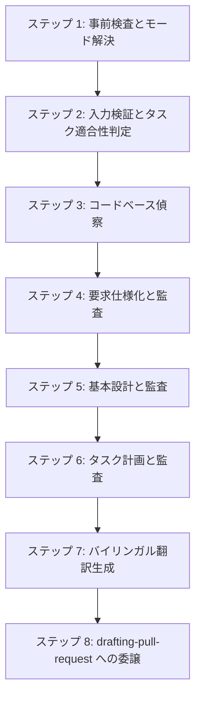

# 計画・設計スキル (`planning-and-designing`)

Spec-Driven Development（SDD: 仕様駆動開発）の**計画・設計フェーズ（フェーズA）**を担当する包括的な仕様エンジニアリングスキルです。

---

## 1. 概要と目的

エージェント主導のソフトウェア開発において、正式な仕様定義を行わずに直接実装に着手すると、要件の幻覚（ハルシネーション）、脆弱なインターフェース設計、テスト不能なコード、および際限のないリファクタリングループを引き起こします。

`planning-and-designing` スキルは、実装開始前にユーザーの高レベルな要求を厳密で検証可能かつバイリンガルな仕様ドキュメントへと変換する、決定論的なマルチステージワークフローを提供します：

1. **要求仕様書 (`requirements.md`)**: 標準的な EARS（Easy Approach to Requirements Syntax: 要求構文への簡易アプローチ）構文、RFC 2119 / RFC 8174 準拠のキーワード、および ISO/IEC/IEEE 29148 の品質特性を用いて、システムが「何を（What）」すべきかを定義します。
2. **基本設計書 (`design.md`)**: コンポーネント境界（外部 API および内部の主要クラス／サービス）、JSON Schema によるデータモデル、通信プロトコル、および DbC（Design by Contract: 契約による設計）を規定し、コンポーネントが「どのように（How）」相互作用するかを定義します。
3. **タスク計画書 (`tasks.md`)**: 基本設計を Stacked PR（スタックド・プルリクエスト）向けに構成されたアトミックで検証可能なタスクへと分解し、永続的な実行ステートマシンとして GitHub Flavored Markdown (GFM) チェックボックスで進捗を追跡します。

---

## 2. コア標準とアーキテクチャの柱

| 仕様成果物 | 準拠標準・仕様 | 主な責務 |
| :--- | :--- | :--- |
| **要求仕様書 (`requirements.md`)** | **EARS** + **RFC 2119 / RFC 8174** + **ISO/IEC/IEEE 29148:2018** | 5つの標準 EARS パターン、大文字の厳格な要件キーワード、5大コア品質特性（非曖昧性、完全性、無矛盾性、検証可能性、追跡可能性）、Mermaid による視覚的モデリング。 |
| **基本設計書 (`design.md`)** | **DbC** + **JSON Schema** + **RFC 9457** | 公開インターフェース契約（事前条件、事後条件、不変条件）、データモデル制約、プロトコル、RFC 9457 標準エラーエンベロープ、主要な設計判断の記録。 |
| **タスク計画書 (`tasks.md`)** | **Stacked PR** + **トレーサビリティマトリクス** + **GFM チェックボックス** | レビュアー向け PR 全体概要、機械的カバレッジマトリクス（`REQ` × `COMP` × `TASK` × `PR`）、進捗管理ステートマシン、障害耐性、全タスク完了後のクリーン再作成。 |
| **メタデータ・バージョニング** | **SemVer 2.0.0** + **ISO 8601** + **YAML フロントマター** | 機械可読なドキュメントメタデータ、上流バージョンの整合性検証（`upstream.requirements`, `upstream.design`）。 |
| **多言語プロトコル** | **ファイル名サフィックス規則** (`*.ja.md`) | 英語ドキュメントを Single Source of Truth（SSOT: 信頼できる唯一の情報源）とし、英語承認後に対話言語版を RFC 2119 JIS 標準対訳に基づき派生生成。 |

---

## 3. サブエージェントエコシステムと品質ゲートウェイ

本スキルは、専用のサブエージェントと協調して Fail-Closed（安全側に倒した停止）の品質ゲートを適用します：

```text
plugins/swe-workflow/agents/
├── requirements-reviewer.md  # EARS および ISO 29148 に基づき requirements.md を監査
├── design-reviewer.md        # DbC、データモデル、RFC 9457 に基づき design.md を監査
├── tasks-reviewer.md         # 追跡可能性、PR の原子性、GFM 追跡に基づき tasks.md を監査
└── decision-analyst.md       # 客観的な設計判断およびアーキテクチャ上のトレードオフを抽出
```

### 客観的サブエージェント監査プロトコル
- **独立コンテキストでの監査**: 執筆者（メインエージェント）の自己迎合バイアスを排除し、厳格で客観的な評価を担保するため、独立したサブエージェントをディスパッチして監査を実行します。
- **監査の収束**: 各レビュー工程の修正ループは最大 **3 回** までとします。3 サイクル経過後も未解決の問題が残る場合、安全に実行を中断（Fail-Closed）し、ユーザーにエスカレーションします。

---

## 4. エンドツーエンドのワークフロープロトコル



1. **ステップ 1: 事前検査とモード解決**:
   機能名をケバブケース（例: `docs/specs/<feature-name>/`）に正規化し、動作モード（新規 v1.0.0、既存改訂、または中断再開）を決定します。
2. **ステップ 2: 入力検証とタスク適合性判定**:
   変更内容が SDD にとって軽微すぎるか（タイポ修正や1行修正など）を判定し、不適合な場合は直接修正を推奨します。曖昧な指示に対しては明確化質問を行い、推測での進行を防止します。
3. **ステップ 3: コードベース偵察**:
   対象リポジトリの開発規約、技術スタック、依存関係、および既存の実装パターンを調査します。
4. **ステップ 4: 要求仕様化と監査**:
   `requirements.md` を作成し、`requirements-reviewer` から `APPROVED`（承認）判定を得ます。
5. **ステップ 5: 基本設計と監査**:
   `design.md` を作成し、`decision-analyst` で設計判断を記録した上で、`design-reviewer` から `APPROVED` 判定を得ます。
6. **ステップ 6: タスク計画と監査**:
   GFM 追跡を含む `tasks.md` を作成し、`tasks-reviewer` から `APPROVED` 判定を得ます。
7. **ステップ 7: バイリンガル翻訳生成**:
   対話言語が英語以外の場合、RFC 2119 JIS 対訳に準拠して忠実な翻訳ファイル（`requirements.ja.md`, `design.ja.md`, `tasks.ja.md`）を派生生成します。
8. **ステップ 8: `drafting-pull-request` への委譲**:
   同一プラグイン内の `drafting-pull-request` を呼び出し、ブランチ保護、Conventional Commits 準拠のコミット作成、およびドラフトプルリクエストの作成を一気通貫で実行します。

---

## 5. ディレクトリ構造と成果物構成

### スキル内アセット
```text
plugins/swe-workflow/skills/planning-and-designing/
├── SKILL.md
├── README.md
├── README.ja.md
├── evals/
│   └── evals.json
└── references/
    ├── requirements-template.md
    ├── design-template.md
    └── tasks-template.md
```

### 生成される仕様成果物
```text
docs/specs/<feature-name>/
├── requirements.md        # 英語 要求仕様書 (Single Source of Truth: SSOT)
├── requirements.ja.md     # 日本語 要求仕様書 (派生成果物)
├── design.md              # 英語 基本設計書 (SSOT)
├── design.ja.md           # 日本語 基本設計書 (派生成果物)
├── tasks.md               # 英語 Stacked PR タスク計画・状態追跡書 (SSOT)
└── tasks.ja.md            # 日本語 Stacked PR タスク計画・状態追跡書 (派生成果物)
```

