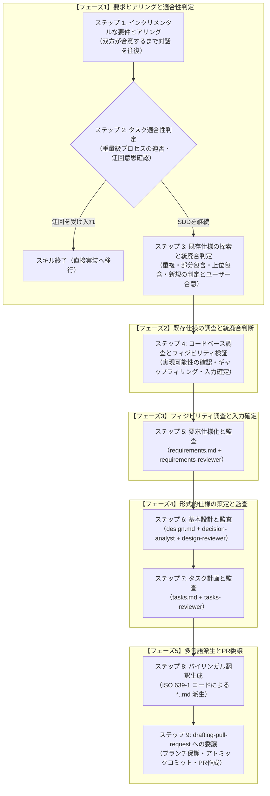

# 計画・設計スキル (`planning-and-designing`)

Spec-Driven Development（SDD: 仕様駆動開発）の**計画・設計フェーズ**を担当する包括的な仕様エンジニアリングスキルです。

---

## 1. 概要と目的

エージェント主導のソフトウェア開発において、正式な仕様定義を行わずに直接実装に着手すると、要件の幻覚（ハルシネーション）、脆弱なインターフェース設計、テスト不能なコード、および際限のないリファクタリングループを引き起こします。

`planning-and-designing` スキルは、実装開始前にユーザーの高レベルな要求を厳密で検証可能かつバイリンガルな仕様ドキュメントへと変換する、決定論的なマルチステージワークフローを提供します：

1. **要求仕様書 (`requirements.md`)**: 標準的な EARS（Easy Approach to Requirements Syntax: 要求構文への簡易アプローチ）構文、RFC 2119 / RFC 8174 準拠のキーワード、および ISO/IEC/IEEE 29148 の品質特性を用いて、システムが「何を（What）」すべきかを定義します。
2. **基本設計書 (`design.md`)**: コンポーネント境界（外部 API および内部の主要クラス／サービス）、JSON Schema によるデータモデル、通信プロトコル、および DbC（Design by Contract: 契約による設計）を規定し、コンポーネントが「どのように（How）」相互作用するかを定義します。
3. **タスク計画書 (`tasks.md`)**: 基本設計を Stacked PR（スタックド・プルリクエスト）向けに構成されたアトミックで検証可能なタスクへと分解し、永続的な実行ステートマシンとして GitHub Flavored Markdown (GFM) チェックボックスで進捗を追跡します。

---

## 2. コア標準とアーキテクチャの柱

| 仕様成果物 | 準拠標準・仕様 | 主な責務 |
| :--- | :--- | :--- |
| **要求仕様書 (`requirements.md`)** | **EARS** + **RFC 2119 / RFC 8174** + **ISO/IEC/IEEE 29148:2018** | 5つの標準 EARS パターン、大文字の厳格な要件キーワード、5大コア品質特性（非曖昧性、完全性、無矛盾性、検証可能性、追跡可能性）、Mermaid による視覚的モデリング。 |
| **基本設計書 (`design.md`)** | **DbC** + **JSON Schema** + **RFC 9457** | 公開インターフェース契約（事前条件、事後条件、不変条件）、データモデル制約、プロトコル、RFC 9457 標準エラーエンベロープ、主要な設計判断の記録。 |
| **タスク計画書 (`tasks.md`)** | **Stacked PR** + **トレーサビリティマトリクス** + **GFM チェックボックス** | レビュアー向け PR 全体概要、機械的カバレッジマトリクス（`REQ` × `COMP` × `TASK` × `PR`）、進捗管理ステートマシン、障害耐性、全タスク完了後のクリーン再作成。 |
| **多言語プロトコル** | **ファイル名サフィックス規則** (`*.<lang>.md`) | 英語ドキュメントを Single Source of Truth（SSOT: 信頼できる唯一の情報源）とし、英語承認後に対話言語の ISO 639-1 コード（例: `*.ja.md`）を用いて標準 RFC 2119 対訳に基づき派生生成。 |

---

## 3. ツールとサブエージェントアーキテクチャ

本スキルは、専用のサブエージェントと協調して Fail-Closed（安全側に倒した停止）の品質ゲートを適用します：

```text
plugins/swe-workflow/agents/
├── requirements-reviewer.md  # EARS および ISO 29148 に基づき requirements.md を監査
├── design-reviewer.md        # DbC、データモデル、RFC 9457 に基づき design.md を監査
├── tasks-reviewer.md         # 追跡可能性、PR の原子性、GFM 追跡に基づき tasks.md を監査
└── decision-analyst.md       # 客観的な設計判断およびアーキテクチャ上のトレードオフを抽出
```

### 客観的サブエージェント監査プロトコル
- **独立コンテキストでの監査**: 執筆者（メインエージェント）の自己迎合バイアスを排除し、厳格で客観的な評価を担保するため、独立したサブエージェントをディスパッチして監査を実行します。
- **監査の収束**: 各レビュー工程の修正ループは最大 **3 回** までとします。3 サイクル経過後も未解決の問題が残る場合、安全に実行を中断（Fail-Closed）し、ユーザーにエスカレーションします。

---

## 4. シーケンシャルワークフロープロトコル



1. **ステップ 1: インクリメンタルな要件ヒアリング**:
   ユーザーの初期プロンプトに対し、課題の本質、アクター、主要ユースケース、境界・例外条件、およびスコープ外事項を対話形式で段階的に質問します。ユーザーの終了意思表示とアシスタントによる情報充足性検証の双方が合致するまでステップを完了させないフェイルクローズ（Fail-Closed）規約を強制します。
2. **ステップ 2: タスク適合性判定と迂回意思確認**:
   変更内容が SDD にとって軽微すぎるか（タイポ修正や1行修正など）を評価します。軽微な場合は直接実装への迂回を提案し、ユーザーが受け入れた場合はスキルを正常終了します。ユーザーが仕様作成を希望した場合は SDD を継続します。
3. **ステップ 3: 既存仕様の探索と統廃合判定**:
   `docs/specs/` 配下の全仕様を探索し、抽出された要件を重複、部分包含、上位包含、新規機能の4パターンに分類します。仕様のトポロジー判定結果と推奨案を提示して必ずユーザーの確認・意思決定を仰ぎ、合意された方針に従ってフィーチャー名を確定します。
4. **ステップ 4: コードベース調査とフィジビリティ検証**:
   対象リポジトリの開発規約、技術スタック、既存パターンを調査し、技術的実現可能性を検証します。技術的トレードオフや不明点をユーザーと対話して埋め切り（ギャップフィリング）、仕様策定のための入力を最終確定します。
5. **ステップ 5: 要求仕様化と監査**:
   確定した入力を元に `requirements.md` を作成し、`requirements-reviewer` から `APPROVED`（承認）判定を得ます。
6. **ステップ 6: 基本設計と監査**:
   `design.md` を作成し、`decision-analyst` で設計判断を記録した上で、`design-reviewer` から `APPROVED` 判定を得ます。
7. **ステップ 7: タスク計画と監査**:
   GFM 追跡を含む `tasks.md` を作成し、`tasks-reviewer` から `APPROVED` 判定を得ます。
8. **ステップ 8: バイリンガル翻訳生成**:
   対話言語が英語以外の場合、対話言語の ISO 639-1 コードを用いて標準 RFC 2119 対訳に準拠した翻訳ファイル（例: `requirements.<lang>.md`, `design.<lang>.md`, `tasks.<lang>.md`）を派生生成します。
9. **ステップ 9: `drafting-pull-request` への委譲**:
   同一プラグイン内の `drafting-pull-request` を呼び出し、ブランチ保護、Conventional Commits 準拠のコミット作成、およびドラフトプルリクエストの作成を一気通貫で実行します。

---

## 5. 生成成果物と構造

### スキル内アセット
```text
plugins/swe-workflow/skills/planning-and-designing/
├── SKILL.md
├── README.md
├── README.ja.md
├── evals/
│   └── evals.json
└── references/
    ├── requirements-template.md
    ├── design-template.md
    └── tasks-template.md
```

### 生成される仕様成果物
```text
docs/specs/<feature-name>/
├── requirements.md            # 英語 要求仕様書 (Single Source of Truth: SSOT)
├── requirements.<lang>.md     # 対話言語版 要求仕様書 (派生成果物、例: *.ja.md)
├── design.md                  # 英語 基本設計書 (SSOT)
├── design.<lang>.md           # 対話言語版 基本設計書 (派生成果物、例: *.ja.md)
├── tasks.md                   # 英語 Stacked PR タスク計画・状態追跡書 (SSOT)
└── tasks.<lang>.md            # 対話言語版 Stacked PR タスク計画・状態追跡書 (派生成果物、例: *.ja.md)
```

