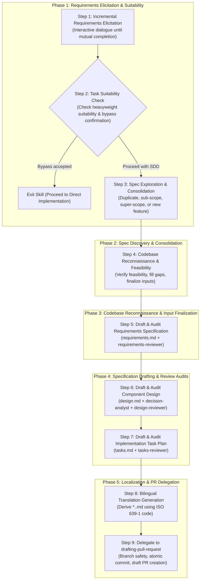

# Planning & Designing Skill (`planning-and-designing`)

Comprehensive specification engineering skill for the **Planning & Design phase (Phase A)** of **Spec-Driven Development (SDD)**.

---

## 1. Overview & Objectives

In agentic software engineering, jump-starting directly into implementation without formal specification leads to hallucinated requirements, brittle interfaces, untestable code, and endless refactoring loops.

The `planning-and-designing` skill provides a deterministic, multi-stage workflow that transforms high-level user requirements into rigorous, verifiable, and bilingual specification documents before implementation begins:

1. **Requirements Specification (`requirements.md`)**: Defines "What" the system must do using standard EARS syntax, RFC 2119 / RFC 8174 keywords, and ISO/IEC/IEEE 29148 quality characteristics.
2. **Architecture & Component Design (`design.md`)**: Defines "How" components interact by specifying Component Boundaries (external APIs and internal major classes/services), JSON Schema data models, protocols, and Design by Contract (DbC).
3. **Implementation Task Plan (`tasks.md`)**: Decomposes design into atomic, verifiable tasks structured for Stacked PRs and tracked via GFM checkboxes as a persistent execution state machine.

---

## 2. Core Standards & Architectural Pillars

| Specification Asset | Standards & Specifications | Key Responsibilities |
| :--- | :--- | :--- |
| **Requirements (`requirements.md`)** | **EARS** + **RFC 2119 / RFC 8174** + **ISO/IEC/IEEE 29148:2018** | Five standard EARS patterns, strict uppercase requirement keywords, 5 core quality characteristics (Unambiguous, Complete, Consistent, Verifiable, Traceable), Mermaid visual modeling. |
| **Component Design (`design.md`)** | **DbC** + **JSON Schema** + **RFC 9457** | Public interface contracts (Preconditions, Postconditions, Invariants), data model constraints, protocols, standard Problem Details error envelope, Key Design Decisions. |
| **Task Planning (`tasks.md`)** | **Stacked PR** + **Traceability Matrix** + **GFM Checkboxes** | Executive PR overview for human reviewers, mechanical coverage matrix (`REQ` × `COMP` × `TASK` × `PR`), progress tracking state machine, crash resiliency, full completion reset. |
| **Multilingual Protocol** | **Filename Suffix Convention** (`*.<lang>.md`) | English document as SSOT; derived translation generated after English approval using target ISO 639-1 code (e.g. `*.ja.md`) and standard RFC 2119 localized mapping. |

---

## 3. Subagents Ecosystem & Quality Gatekeeping

This skill coordinates dedicated subagents to enforce fail-closed quality gatekeeping:

```text
plugins/swe-workflow/agents/
├── requirements-reviewer.md  # Audits requirements.md against EARS & ISO 29148
├── design-reviewer.md        # Audits design.md against DbC, data models, and RFC 9457
├── tasks-reviewer.md         # Audits tasks.md against traceability, PR atomicity, and GFM tracking
└── decision-analyst.md       # Extracts objective design decisions & architectural trade-offs
```

### Objective Subagent Review Protocol
- **Isolated Context Audits**: Audits are strictly executed by dispatching isolated subagents to ensure objective evaluation without confirmation bias.
- **Audit Convergence**: Each review loop allows a maximum of **3 iterations**. If issues remain unresolved after 3 cycles, execution halts safely (Fail-Closed) and escalates to the user.

---

## 4. End-to-End Workflow Protocol



1. **Step 1: Incremental Requirements Elicitation**:
   Conducts multi-turn dialogue to clarify problem, actors, happy paths, edge cases, and out-of-scope items. Strict exit criteria requires both user sign-off and assistant verification of requirements sufficiency.
2. **Step 2: Task Suitability Assessment & Bypass Decision**:
   Evaluates whether change is too lightweight for SDD (typos, 1-line fixes). Offers user bypass option: if accepted, terminates skill gracefully; if declined, continues formal SDD.
3. **Step 3: Specification Exploration & Scope Consolidation**:
   Analyzes existing specs under `docs/specs/` to classify into Duplicate, Sub-scope, Super-scope, or New Feature. Mandates user confirmation to decide consolidation strategy and normalizes feature name.
4. **Step 4: Codebase Reconnaissance & Technical Feasibility Verification**:
   Inspects codebase conventions, tech stack, and patterns. Verifies technical feasibility, conducts gap-filling dialogue with user, and finalizes authoring inputs.
5. **Step 5: Requirements Specification & Audit**:
   Drafts `requirements.md` and achieves `APPROVED` verdict from `requirements-reviewer`.
6. **Step 6: Component Design & Audit**:
   Drafts `design.md`, extracts design decisions via `decision-analyst`, and achieves `APPROVED` verdict from `design-reviewer`.
7. **Step 7: Task Planning & Audit**:
   Drafts `tasks.md` with GFM tracking and achieves `APPROVED` verdict from `tasks-reviewer`.
8. **Step 8: Bilingual Translation Generation**:
   Generates faithful localized files (e.g. `requirements.<lang>.md`, `design.<lang>.md`, `tasks.<lang>.md`) using target ISO 639-1 code and RFC 2119 mapping if user conversation is non-English.
9. **Step 9: Delegate to `drafting-pull-request`**:
   Invokes `drafting-pull-request` to handle branch safety, Conventional Commit creation, and Draft PR submission.

---

## 5. Directory Structure & Generated Artifacts

### Skill Assets
```text
plugins/swe-workflow/skills/planning-and-designing/
├── SKILL.md
├── README.md
├── README.ja.md
├── evals/
│   └── evals.json
└── references/
    ├── requirements-template.md
    ├── design-template.md
    └── tasks-template.md
```

### Generated Specification Artifacts
```text
docs/specs/<feature-name>/
├── requirements.md            # English Requirements Specification (SSOT)
├── requirements.<lang>.md     # Localized Requirements Specification (Derived, e.g. *.ja.md)
├── design.md                  # English Architecture & Component Design (SSOT)
├── design.<lang>.md           # Localized Architecture & Component Design (Derived, e.g. *.ja.md)
├── tasks.md                   # English Stacked PR Task Plan & State Tracker (SSOT)
└── tasks.<lang>.md            # Localized Stacked PR Task Plan & State Tracker (Derived, e.g. *.ja.md)
```

