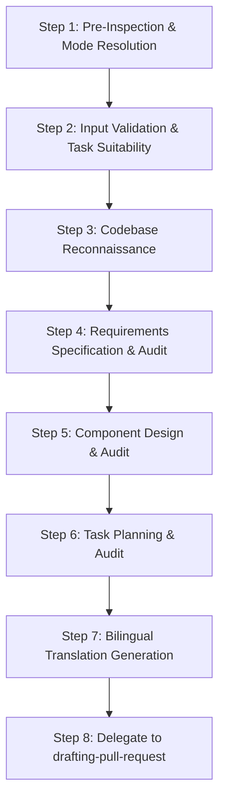

# Planning & Designing (SDD Phase A)

This skill guides the end-to-end execution of the Planning & Design phase of Spec-Driven Development (SDD). It transforms user requirements into rigorous, verifiable, and bilingual specification assets (`requirements.md`, `design.md`, `tasks.md`) stored under `docs/specs/<feature-name>/`.

---

## Workflow Protocol

Follow these sequential steps whenever planning and designing a new feature or specification revision:

---

### Step 1: Pre-Inspection & Mode Resolution

1. **Normalize Feature Name**:
   - Synthesize or extract the target feature name and normalize it to lowercase kebab-case (`^[a-z0-9-]+$`, e.g. `user-authentication`, `csv-exporter`).
   - The canonical target directory is `docs/specs/<feature-name>/`.

2. **Scan Existing Specification Assets**:
   Inspect `docs/specs/<feature-name>/` to determine the execution mode:
   - **Initial Mode (0 existing files)**:
     - No specification documents exist. Initialize a new specification starting at version `1.0.0`.
   - **Revision Mode (complete existing files exist)**:
     - Read the YAML frontmatter of existing files (`version`, `status`, `upstream`).
     - Determine whether the revision is triggered by new requirements (Type A) or implementation defect feedback (Type B).
   - **Resume Mode (partial files exist)**:
     - If previous execution was interrupted (e.g. `requirements.md` exists but `design.md` is missing), resume execution from the first uncompleted step.

---

### Step 2: Input Validation, Task Suitability & Fail-Closed Protocol

1. **Task Suitability Assessment (Heavyweight Process Check)**:
   - SDD is a heavyweight process involving multi-stage formal modeling, DbC contracts, and multi-subagent auditing.
   - **Unsuitable Tasks**: Typo fixes, 1-2 line localized bug fixes, documentation typos, or trivial configuration tweaks.
   - **Protocol**: If the task is identified as unsuitable/trivial:
     - **HALT and inform the user**: "This task appears to be a lightweight or localized change. SDD is a heavyweight multi-stage process that introduces significant overhead for minor tweaks. We recommend proceeding with direct implementation and commit/PR creation instead. Do you still wish to generate formal specifications?"
     - Proceed with SDD ONLY if the user explicitly confirms.

2. **Fail-Closed Missing Information Protocol**:
   - Evaluate whether the user's request provides sufficient clarity regarding:
     1. Core problem and business/technical motivation.
     2. Primary actors and intended use cases.
     3. Known constraints or out-of-scope boundaries.
   - **Strict Fail-Closed Rule**: If the request is fundamentally ambiguous, contradictory, or missing core intent, **DO NOT proceed with speculative assumptions**. Present clear, structured clarifying questions to the user and await input.

---

### Step 3: Codebase Reconnaissance

Before drafting formal specifications, inspect the target project's codebase to anchor requirements and architecture to concrete realities:
1. **Target Project Guidelines**:
   - Inspect `AGENTS.md`, `CLAUDE.md`, `.cursorrules`, or repository guidelines if present.
2. **Architecture & Technology Stack**:
   - Inspect package manifests (`package.json`, `pyproject.toml`, `Cargo.toml`, `go.mod`, etc.) to identify programming language, dependencies, and testing frameworks.
3. **Existing Patterns & Component Boundaries**:
   - Search for related modules, existing data models, interface patterns, and error handling conventions to ensure seamless integration.

---

### Step 4: Draft & Audit Requirements Specification (`requirements.md`)

1. **Draft English SSOT**:
   - Create or update `docs/specs/<feature-name>/requirements.md` conforming strictly to [`references/requirements-template.md`](./references/requirements-template.md).
   - Enforce standard EARS syntax patterns (Ubiquitous, Event-driven, State-driven, Unwanted behavior, Optional feature, Complex).
   - Apply uppercase RFC 2119 / RFC 8174 keywords (`MUST`, `MUST NOT`, `SHOULD`, `SHOULD NOT`, `MAY`).
   - Satisfy ISO/IEC/IEEE 29148:2018 quality characteristics (Unambiguous, Complete, Consistent, Verifiable, Traceable).
   - Include valid Mermaid diagrams (use cases or flowcharts) for human visual modeling.
   - Assign unique, immutable requirement IDs (`REQ-001`, `REQ-002`, etc.).

2. **Audit via `requirements-reviewer` Subagent (Max 3 Iterations)**:
   - **Invocation**: Invoke the dedicated `requirements-reviewer` subagent to audit `requirements.md`.
   - **Convergence**:
     - If `CHANGES_REQUIRED`: address all identified defects and re-audit (up to 3 total iterations).
     - If unresolved after 3 iterations: **HALT safely (Fail-Closed)** and escalate specific blocker findings to the user.
     - Proceed to Step 5 only upon receiving **APPROVED**.

---

### Step 5: Draft & Audit Architecture & Component Design (`design.md`)

1. **Draft English SSOT**:
   - Create or update `docs/specs/<feature-name>/design.md` conforming strictly to [`references/design-template.md`](./references/design-template.md).
   - Set frontmatter `upstream.requirements` to match the approved `requirements.md` version.
   - **Component Boundaries**: Define component IDs (`COMP-001`, `COMP-002`, etc.) covering external exposed interfaces (CLI, API) and major internal software boundaries (classes, domain services, repositories). Exclude private implementation details.
   - **Data Models**: Specify input/output schemas using standard JSON Schema constraint vocabulary (`type`, `required`, `minLength`, `maximum`, `pattern`, `enum`).
   - **Protocols**: Specify transport protocols, CLI exit codes, HTTP status mappings, timeouts, and retry policies.
   - **Design by Contract (DbC)**: Express Preconditions, Postconditions, and Invariants using uppercase RFC 2119 / 8174 keywords.
   - **Error Handling**: Specify RFC 9457 Problem Details for external interfaces and structured exception hierarchies for internal components.
   - **Visual Modeling**: Include Mermaid sequence diagrams and/or state machines.

2. **Extract Design Decisions via `decision-analyst` Subagent**:
   - Invoke the `decision-analyst` subagent to extract non-trivial architectural decisions and trade-offs.
   - Embed extracted decisions into Section 7 of `design.md`.

3. **Audit via `design-reviewer` Subagent (Max 3 Iterations)**:
   - Invoke the dedicated `design-reviewer` subagent to audit `design.md`.
   - Enforce fail-closed convergence (max 3 iterations; escalate if unresolved).
   - Proceed to Step 6 only upon receiving **APPROVED**.

---

### Step 6: Draft & Audit Implementation Task Plan (`tasks.md`)

1. **Draft English SSOT**:
   - Create or update `docs/specs/<feature-name>/tasks.md` conforming strictly to [`references/tasks-template.md`](./references/tasks-template.md).
   - Set frontmatter `upstream.requirements` and `upstream.design` to match current versions.
   - **Executive PR Overview**: Provide a structured summary of planned Stacked PRs, target branches, scope, and merge order for human review.
   - **Traceability Matrix**: Complete mapping table covering `REQ-xxx` × `COMP-xxx` × `TASK-xxx` × `PR-x` with zero gaps.
   - **Progress Tracking State Machine**: Format all tasks and acceptance criteria with GFM checkboxes (`- [ ]`).
   - **Atomic Commit Loop Readiness**: Ensure each task is structured for independent execution, testing, and atomic commit alongside `tasks.md`.
   - **Lifecycle on Revision**: If all previous tasks were completed, cleanly reset/recreate the task list for the new revision.

2. **Audit via `tasks-reviewer` Subagent (Max 3 Iterations)**:
   - Invoke the dedicated `tasks-reviewer` subagent to audit `tasks.md`.
   - Enforce fail-closed convergence (max 3 iterations; escalate if unresolved).
   - Proceed to Step 7 only upon receiving **APPROVED**.

---

### Step 7: Bilingual Translation Generation

Once all three English SSOT documents (`requirements.md`, `design.md`, `tasks.md`) achieve **APPROVED** status:
1. **Detect Conversation Language**:
   - If the active user conversation is in English, skip translation.
2. **Generate Localized Documents (Derived Translation)**:
   - If the conversation is in a non-English language (e.g. Japanese):
     - Generate `requirements.ja.md` translating `requirements.md` using standard RFC 2119 mapping (`MUST` -> 「〜しなければならない」, `MUST NOT` -> 「〜してはならない」, `SHOULD` -> 「〜することが推奨される」, `MAY` -> 「〜してもよい」).
     - Generate `design.ja.md` translating `design.md` maintaining code signatures and translating contract clauses.
     - Generate `tasks.ja.md` translating `tasks.md`.
   - Maintain identical frontmatter versions and `upstream` references across language pairs.

---

### Step 8: Delegate to `drafting-pull-request`

Do NOT perform manual Git branching or piecemeal commits during this skill. Instead, delegate the finalized assets to the existing `drafting-pull-request` skill within the same plugin:

1. **Execute `drafting-pull-request`**:
   - The `drafting-pull-request` skill automatically inspects branch safety, switches to an appropriate feature branch if on a protected branch, groups uncommitted specification files into an atomic Conventional Commit (`docs(specs): add planning and design specification for <feature-name>`), and creates a GitHub Draft PR with folded bilingual details.
2. **Review Output**:
   - Confirm Draft PR URL and present the completed specification assets and PR link to the user for human review.

