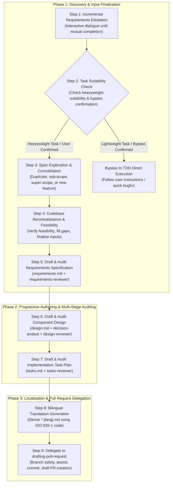

# Planning & Designing (Spec-Driven Development)

This skill guides the end-to-end execution of the planning and designing phase of Spec-Driven Development (SDD). It transforms user requirements into rigorous, verifiable, and bilingual specification assets (`requirements.md`, `design.md`, `tasks.md`) stored under `docs/specs/{feature-name}/`.

---

## Workflow Protocol

Follow these sequential steps whenever planning and designing a new feature or specification revision:

---

### Specification Frontmatter Lifecycle & Timestamp Invariant

All specification documents (`requirements.md`, `design.md`, `tasks.md`, and derived translations) strictly adhere to this frontmatter lifecycle state machine:
- `status: draft`: Initial authoring or active revision drafting before review.
- `status: in-review`: Formal subagent audit review in progress.
- `status: approved`: Objective subagent reviewer approval granted (`APPROVED` verdict).
- `status: superseded`: Specification consolidated or replaced by a super-scope specification or retired.

**Strict Timestamp Invariant**: Whenever `status` transitions (`draft` ➔ `in-review`, `in-review` ➔ `draft`, `in-review` ➔ `approved`, `approved` ➔ `superseded`, `approved` ➔ `draft`), the frontmatter `updated_at` MUST be simultaneously updated to the current date in ISO 8601 format (`YYYY-MM-DD`).

---

### Step 1: Incremental Requirements Elicitation

Users typically cannot convey full requirements in a single initial prompt. Step 1 conducts an interactive, multi-turn elicitation dialogue to crystallize ambiguous or high-level user ideas into robust requirements before any repository inspection occurs:

1. **Structured Elicitation Inquiries**:
   - Actively ask targeted questions to clarify:
     1. **Core Problem & Motivation**: What problem are we solving, and why?
     2. **Actors & Personas**: Who or what uses this feature (developers, end users, external services)?
     3. **Primary Use Cases**: What is the happy path and primary user journey?
     4. **Boundary & Edge Conditions**: What are the input constraints, rate limits, timeouts, and negative scenarios?
     5. **Out of Scope (Explicit Boundaries)**: What will we deliberately NOT implement in this iteration?

2. **Strict Mutual Exit Criteria (Fail-Closed)**:
   Step 1 MUST NOT complete until **both** conditions are satisfied:
   - **User Sign-off**: The user explicitly states that they have conveyed all initial requirements and have nothing further to add.
   - **Assistant Sufficiency Verification**: The assistant objectively verifies that necessary requirements information (motivation, primary actors, happy paths, edge cases, out-of-scope boundaries) is sufficiently clear to anchor formal specifications.
   - **Fail-Closed Rule**: If critical ambiguities or missing points remain, the assistant **MUST NOT terminate Step 1**, even if the user signals completion. The assistant must present the specific unaddressed questions and continue clarification. Step 1 is complete ONLY when both criteria are met.

---

### Step 2: Task Suitability Assessment & Bypass Decision

1. **Heavyweight Process Evaluation**:
   - SDD is a heavyweight process involving multi-stage formal modeling, DbC contracts, and multi-subagent auditing.
   - **Unsuitable Tasks**: Typo fixes, 1-2 line localized bug fixes, documentation typos, or trivial configuration tweaks.

2. **User Decision & Branch Control**:
   - If the task is identified as lightweight/trivial:
     - **Prompt the user**: "This task appears to be a lightweight or localized change. SDD is a heavyweight multi-stage process that introduces significant overhead for minor tweaks. We recommend proceeding with direct implementation and commit/PR creation instead. Would you like to bypass SDD, or do you still wish to generate formal specifications?"
     - **Bypass Accepted**: If the user accepts the bypass, **terminate the `planning-and-designing` skill gracefully** and proceed to direct code implementation.
     - **Bypass Declined (SDD Requested)**: If the user insists on formal specifications, continue the SDD process and proceed to Step 3.

---

### Step 3: Specification Exploration & Scope Consolidation

Once concrete requirements are elicited, inspect the full specification landscape under `docs/specs/` across the repository to determine the architectural topology and consolidation strategy:

1. **Analyze Existing Specification Topology**:
   Compare the elicited requirements against all existing specification directories under `docs/specs/` and classify into one of four patterns:
   - **Duplicate**: An existing spec covers the exact same scope -> Propose revising/updating the existing spec.
   - **Sub-scope**: The requirements represent a sub-feature or extension of an existing, broader spec -> Propose integrating into the existing spec as an added module or revision.
   - **Super-scope**: The requirements encompass or unify multiple smaller, existing specs -> Propose consolidating and superseding those existing specs. When consolidating, update the YAML frontmatter of the superseded specification documents to `status: superseded` and update their `updated_at` to the current date (`YYYY-MM-DD`).
   - **New Feature**: The requirements represent an entirely independent feature -> Establish a new feature directory.

2. **Mandatory User Confirmation & Decision Authority**:
   - Architectural and domain boundaries cannot always be determined mechanically.
   - The assistant **MUST present its topology findings and recommended consolidation strategy to the user and seek explicit confirmation**.
   - The assistant **MUST abide by the user's final decision** regarding whether to create a new spec or consolidate into an existing one.

3. **Normalize Feature Name & Determine Execution Mode**:
   - Normalize the confirmed feature name to lowercase kebab-case (`^[a-z0-9-]+$`, e.g. `user-authentication`, `csv-exporter`).
   - The canonical target directory is `docs/specs/{feature-name}/`.
   - Inspect `docs/specs/{feature-name}/` to determine mode:
     - **Initial Mode (0 existing files)**: Start at version `1.0.0` with `status: draft` and `updated_at` set to current date.
     - **Revision Mode (complete existing files exist)**: Inspect YAML frontmatter (`version`, `status`, `upstream`), determine SemVer increment (`MAJOR.MINOR.PATCH`), and initialize revised documents with incremented version, `status: draft`, and `updated_at` set to current date.
     - **Resume Mode (partial files exist)**: Resume execution from the first uncompleted step.

---

### Step 4: Codebase Reconnaissance & Technical Feasibility Verification

Ground the elicited requirements and architecture in the technical realities of the target codebase:

1. **Target Codebase Reconnaissance**:
   - **Guidelines**: Inspect `AGENTS.md`, `CLAUDE.md`, `.cursorrules`, or repository guidelines if present.
   - **Tech Stack & Dependencies**: Inspect package manifests (`package.json`, `pyproject.toml`, `Cargo.toml`, `go.mod`, etc.) to identify languages, runtime libraries, and testing frameworks.
   - **Existing Architecture Patterns**: Search for related modules, existing data models, interface patterns, and error handling conventions.

2. **Feasibility Verification & Gap-Filling Dialogue**:
   - Evaluate whether the elicited requirements are technically feasible within the existing codebase constraints.
   - If technical discrepancies, architectural trade-offs, or integration questions arise (e.g. choice of authentication library, database migration strategy), interview the user to resolve them.

3. **Strict Technical Exit Criteria (Fail-Closed)**:
   - The assistant MUST NOT terminate Step 4 until it objectively verifies that all technical prerequisites, architecture choices, and integration boundaries needed to draft `requirements.md`, `design.md`, and `tasks.md` are **completely determined and verified**.
   - Once all technical gaps are filled, the inputs for specification authoring are permanently **finalized**.

---

### Step 5: Draft & Audit Requirements Specification (`requirements.md`)

1. **Draft English SSOT**:
   - Create or update `docs/specs/{feature-name}/requirements.md` conforming strictly to [`references/requirements-template.md`](./references/requirements-template.md) using the finalized inputs, initialized with `status: draft` and `updated_at` set to the current date (`YYYY-MM-DD`).
   - Enforce standard EARS syntax patterns (Ubiquitous, Event-driven, State-driven, Unwanted behavior, Optional feature, Complex).
   - Apply uppercase RFC 2119 / RFC 8174 keywords (`MUST`, `MUST NOT`, `SHOULD`, `SHOULD NOT`, `MAY`).
   - Satisfy ISO/IEC/IEEE 29148:2018 quality characteristics (Unambiguous, Complete, Consistent, Verifiable, Traceable).
   - **Specify Black-Box Externally Observable Behavior**: Define "What to build" exclusively from the perspective of external actors (users or external systems). Requirements statements and use cases MUST describe externally observable stimuli, responses, feedback notifications, data presentations, and boundary constraints. Strictly preserve the solution space for `design.md`: do NOT leak implementation details (e.g. no HTTP methods/endpoints, HTTP status codes, SQL statements, database table/column names, or framework-specific classes/annotations).
   - **Visual Modeling via Prescriptive Patterns**: Include valid Mermaid diagrams strictly depicting the system boundary from the perspective of external actors, selecting one or more of the four standard prescriptive patterns based on the primary modeling concern:
     - **Interaction Sequence (`sequenceDiagram`)**: For request/response messaging, stimulus-response dialogues, and alternate error flows between external actors and the system boundary. Strictly omit manual activation boxes (`activate`/`deactivate` or `+`/`-` shortcuts) to prevent GitHub rendering errors (`Trying to inactivate an inactive participant`) caused by linear parsing across conditional branches (`alt`/`else`).
     - **Activity / Decision Flow (`flowchart TD` or `flowchart LR`)**: For event-driven condition evaluation, validation branching, and fallback paths leading to observable outcomes, organized into structured `subgraph` blocks.
     - **System Context Scope (`flowchart LR` or `flowchart TD`)**: For mapping external actors to discrete system use cases and boundary scope boundaries.
     - **Observable State Transition (`stateDiagram-v2`)**: For externally observable domain entity lifecycles and event-triggered state transitions.
     - **Strict System Boundary Rule**: Visual diagrams in `requirements.md` MUST NOT penetrate the system boundary to illustrate internal component pipelines, class hierarchies, or data store entities (e.g. `DB[(Database)]`; reserve internal implementation flows for `design.md`).
   - Assign unique, immutable requirement IDs (`REQ-001`, `REQ-002`, etc.).

2. **Audit via `requirements-reviewer` Subagent (Max 3 Iterations)**:
   - **Transition to In-Review**: Set frontmatter to `status: in-review` and update `updated_at` to the current date (`YYYY-MM-DD`) before invoking the reviewer.
   - **Invocation**: Invoke the dedicated `requirements-reviewer` subagent to audit `requirements.md`.
   - **Convergence**:
     - If `CHANGES_REQUIRED`: set `status: draft` and update `updated_at` while resolving defects, then set `status: in-review` and update `updated_at` upon re-audit (up to 3 total iterations).
     - If unresolved after 3 iterations: **HALT safely (Fail-Closed)** and escalate specific blocker findings to the user.
     - Upon receiving **APPROVED**: Immediately update frontmatter to `status: approved` and update `updated_at` to the current date (`YYYY-MM-DD`). Proceed to Step 6 only upon receiving **APPROVED**.

---

### Step 6: Draft & Audit Architecture & Component Design (`design.md`)

1. **Draft English SSOT**:
   - Create or update `docs/specs/{feature-name}/design.md` conforming strictly to [`references/design-template.md`](./references/design-template.md), initialized with `status: draft` and `updated_at` set to the current date (`YYYY-MM-DD`).
   - Set frontmatter `upstream.requirements` to match the approved `requirements.md` version.
   - **Component Boundaries**: Define component IDs (`COMP-001`, `COMP-002`, etc.) covering external exposed interfaces (CLI, API) and major internal software boundaries (classes, domain services, repositories). Exclude private implementation details.
   - **Data Models**: Specify input/output schemas and database entity models using structured Markdown tables conforming to standard JSON Schema constraint vocabulary (`type`, `required`, `minLength`, `maximum`, `pattern`, `enum`, `minItems`, `maxItems`). Represent nested structures using dot notation (`parent.child`, `items[].property`) or dedicated sub-model tables. Explicitly define empty collection and absence safety semantics (strictly guaranteeing empty collection `[]` vs. absent/omitted properties or nullable values).
   - **Protocols**: Specify transport protocols, CLI exit codes, HTTP status mappings, timeouts, and retry policies.
   - **Design by Contract (DbC)**: Express Preconditions, Postconditions, and Invariants using uppercase RFC 2119 / 8174 keywords. Explicitly define postconditions for empty collection scenarios (e.g. callee guarantees returning `[]` rather than omitting fields or returning absent values).
   - **Error Handling**: Specify RFC 9457 Problem Details for external interfaces and structured exception hierarchies for internal components.
   - **Visual Modeling**: Include Mermaid sequence diagrams and/or state machines. In sequence diagrams, omit manual activation boxes (`activate`/`deactivate` or `+`/`-` shortcuts) to prevent activation stack mismatch errors during GitHub rich display rendering.

2. **Extract Design Decisions via `decision-analyst` Subagent**:
   - Invoke the `decision-analyst` subagent to extract non-trivial architectural decisions and trade-offs.
   - Embed extracted decisions into Section 7 of `design.md`.

3. **Audit via `design-reviewer` Subagent (Max 3 Iterations)**:
   - **Transition to In-Review**: Set frontmatter to `status: in-review` and update `updated_at` to the current date (`YYYY-MM-DD`) before invoking the reviewer.
   - **Invocation**: Invoke the dedicated `design-reviewer` subagent to audit `design.md`.
   - **Convergence**:
     - If `CHANGES_REQUIRED`: set `status: draft` and update `updated_at` while resolving defects, then set `status: in-review` and update `updated_at` upon re-audit (up to 3 total iterations).
     - If unresolved after 3 iterations: **HALT safely (Fail-Closed)** and escalate specific blocker findings to the user.
     - Upon receiving **APPROVED**: Immediately update frontmatter to `status: approved` and update `updated_at` to the current date (`YYYY-MM-DD`). Proceed to Step 7 only upon receiving **APPROVED**.

---

### Step 7: Draft & Audit Implementation Task Plan (`tasks.md`)

1. **Draft English SSOT**:
   - Create or update `docs/specs/{feature-name}/tasks.md` conforming strictly to [`references/tasks-template.md`](./references/tasks-template.md), initialized with `status: draft` and `updated_at` set to the current date (`YYYY-MM-DD`).
   - Set frontmatter `upstream.requirements` and `upstream.design` to match current versions.
   - **Executive PR Overview**: Provide a structured summary of planned Stacked PRs, target branches, scope, and merge order for human review.
   - **Traceability Matrix**: Complete mapping table covering `REQ-xxx` × `COMP-xxx` × `TASK-xxx` × `PR-x` with zero gaps.
   - **Progress Tracking State Machine**: Format all tasks and acceptance criteria with GFM checkboxes (`- [ ]`).
   - **Atomic Commit Loop Readiness**: Ensure each task is structured for independent execution, testing, and atomic commit alongside `tasks.md`.
   - **Lifecycle on Revision**: If all previous tasks were completed, cleanly reset/recreate the task list for the new revision.

2. **Audit via `tasks-reviewer` Subagent (Max 3 Iterations)**:
   - **Transition to In-Review**: Set frontmatter to `status: in-review` and update `updated_at` to the current date (`YYYY-MM-DD`) before invoking the reviewer.
   - **Invocation**: Invoke the dedicated `tasks-reviewer` subagent to audit `tasks.md`.
   - **Convergence**:
     - If `CHANGES_REQUIRED`: set `status: draft` and update `updated_at` while resolving defects, then set `status: in-review` and update `updated_at` upon re-audit (up to 3 total iterations).
     - If unresolved after 3 iterations: **HALT safely (Fail-Closed)** and escalate specific blocker findings to the user.
     - Upon receiving **APPROVED**: Immediately update frontmatter to `status: approved` and update `updated_at` to the current date (`YYYY-MM-DD`). Proceed to Step 8 only upon receiving **APPROVED**.

---

### Step 8: Bilingual Translation Generation

Once all three English SSOT documents (`requirements.md`, `design.md`, `tasks.md`) achieve **APPROVED** status:
1. **Detect Conversation Language**:
   - If the active user conversation is in English, skip translation (the English SSOT documents are sufficient).
2. **Generate Localized Documents (Derived Translation)**:
   - If the conversation is in a non-English language:
     - Identify the ISO 639-1 language code of the user's active conversation (e.g. `ja` for Japanese, `zh` for Chinese, `fr` for French, `de` for German, `es` for Spanish, etc.).
     - Generate `requirements.{lang}.md` translating `requirements.md` using standard RFC 2119 / 8174 localized mapping for that language (e.g. for Japanese: `MUST` -> 「〜しなければならない」, `MUST NOT` -> 「〜してはならない」, `SHOULD` -> 「〜することが推奨される」, `MAY` -> 「〜してもよい」).
     - Generate `design.{lang}.md` translating `design.md` while maintaining code signatures and translating contract clauses.
     - Generate `tasks.{lang}.md` translating `tasks.md` preserving checkbox states and matrix structure.
   - Maintain identical frontmatter versions, `status: approved`, `updated_at`, and `upstream` references across language pairs.

---

### Step 9: Delegate to `drafting-pull-request`

Do NOT perform manual Git branching or piecemeal commits during this skill. Instead, delegate the finalized assets to the existing `drafting-pull-request` skill within the same plugin:

1. **Execute `drafting-pull-request`**:
   - The `drafting-pull-request` skill automatically inspects branch safety, switches to an appropriate feature branch if on a protected branch, groups uncommitted specification files (all verified in `status: approved`) into an atomic Conventional Commit (`docs(specs): add planning and design specification for {feature-name}`), and creates a GitHub Draft PR with folded bilingual details.
2. **Review Output**:
   - Confirm Draft PR URL and present the completed specification assets and PR link to the user for human review.

