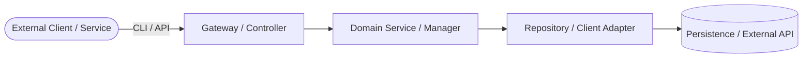
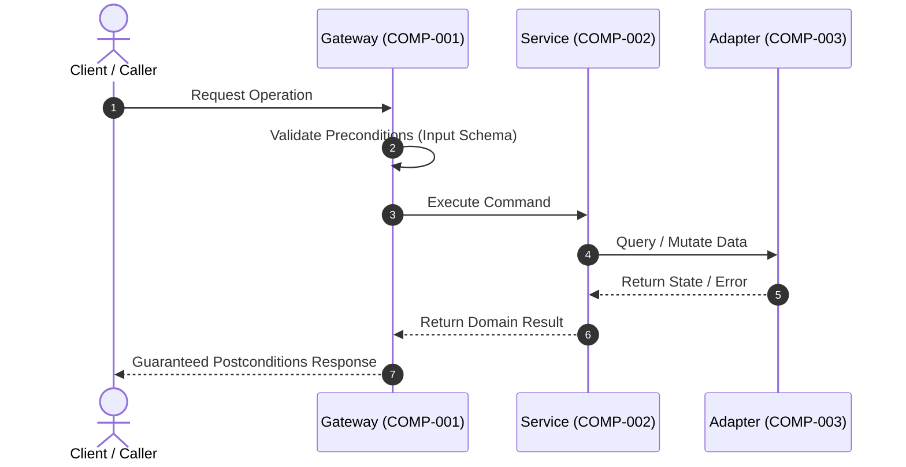

# Architecture & Component Design: <Feature Name>

<!--
Guidelines:
1. Target both external exposed interfaces (CLI, API) and internal component boundaries (services, repositories, domain models, public classes).
2. DO NOT specify internal loop implementations or private helper algorithms (reserve for implementation code).
3. Express all contract assertions (DbC) using uppercase RFC 2119/8174 keywords (MUST, MUST NOT, SHALL).
4. Comply with RFC 9457 for error definitions.
5. Upstream requirements version MUST match the current version of requirements.md.
6. Frontmatter Status Lifecycle: Initialized as `status: draft`. Transitions to `status: in-review` when submitting for subagent review, `status: approved` upon reviewer APPROVED verdict, and `status: superseded` if replaced or consolidated. Always update `updated_at` (ISO 8601 `YYYY-MM-DD`) whenever `status` transitions.
-->

## 1. Component Boundaries & Scope Overview

### 1.1 Architecture & Component Map
<Describe the major components, modules, classes, and service boundaries involved in this feature.>



### 1.2 Component Inventory
| Component ID | Component / Class Name | Scope / Boundary | Linked Requirements |
| :--- | :--- | :--- | :--- |
| **COMP-001** | `<Gateway/Controller/CLI>` | External Exposed Interface | `REQ-001`, `REQ-002` |
| **COMP-002** | `<DomainService/Class>` | Internal Core Component | `REQ-003`, `REQ-004` |
| **COMP-003** | `<Repository/Client>` | Internal Integration Boundary | `REQ-005`, `REQ-006` |

---

## 2. Interaction Modeling

<!--
Guidelines for Sequence Diagrams:
1. Omit manual activation boxes (activate/deactivate or +/- shortcuts) by default.
2. Never use activation boxes across branching constructs (alt/else, opt, par, loop).
   Mermaid parses diagrams linearly without branch-isolated stacks; deactivating in multiple
   branches causes fatal GitHub rendering errors ("Trying to inactivate an inactive participant").
-->



---

## 3. Data Models & Schema Constraints

All input payloads, domain structures, output responses, and database entity models are defined using structured Markdown tables conforming to standard constraint vocabulary.

<!--
Guidelines for Data Model Modeling & Hierarchical Fields:
1. Flat / Shallow Nesting (1-2 levels): Use dot notation within the same table:
   e.g. `parent.child` for objects, or `items[].property` for arrays of objects.
2. Deep Nesting / Reused Models: Decompose into separate sub-model tables (e.g. `### 3.1.1 <SubModelName>`)
   and reference them by model name in the parent table's `Type` column (e.g. `AddressModel`, `array<OrderItemModel>`).
3. Standard Constraint Vocabulary: Use JSON Schema terms (`minLength`, `maxLength`, `minimum`, `maximum`, `pattern`, `enum`, `format`, `minItems`, `maxItems`).
4. Collection & Absence Safety: For array/collection fields, explicitly define whether 0-element results yield an empty collection (`[]`), an absent/omitted property, or a nullable value. In output models, always guarantee an empty collection `[]` (e.g. `minItems: 0 (guaranteed [] on empty)`) rather than omission or absent values to prevent client-side template or runtime crashes.
-->

### 3.1 `<InputDataModelName>` (Input / Payload)
- **Format**: JSON Schema / Project Type Signature

| Field Name | Type | Required / Optional | Constraints | Description |
| :--- | :--- | :--- | :--- | :--- |
| `field_a` | `string` | Required | `minLength: 1`, `maxLength: 255`, `pattern: "^[a-z0-9-]+$"` | Primary identifier or slug |
| `field_b` | `integer` | Optional | `minimum: 0`, `maximum: 1000`, `default: 10` | Page size or quantity limit |
| `field_c` | `string` (enum) | Required | `enum: ["active", "suspended", "archived"]` | Lifecycle status indicator |
| `nested` | `object` | Optional | - | Nested object payload |
| `nested.sub_field` | `string` | Required | `minLength: 1` | Inline sub-field using dot notation |
| `items` | `array<object>` | Optional | `minItems: 0 (guaranteed [] on empty)`, `maxItems: 50` | List of line items |
| `items[].item_id` | `string` | Required | `format: "uuid"` | Item identifier within array |

### 3.2 `<OutputDataModelName>` (Output / Result)
- **Format**: JSON Schema / Project Type Signature

| Field Name | Type | Required / Optional | Constraints | Description |
| :--- | :--- | :--- | :--- | :--- |
| `id` | `string` | Required | `format: "uuid"` (UUIDv4) | Unique resource identifier |
| `status` | `string` | Required | `enum: ["active", "suspended", "archived"]` | Execution status indicator |
| `items` | `array<object>` | Required | `minItems: 0 (guaranteed [] on empty)` | List of result items (never omitted or absent) |
| `created_at` | `string` | Required | `format: "date-time"` (ISO 8601 UTC) | Timestamp of resource creation |

### 3.3 `<DatabaseEntityModelName>` (Database Entity / Persistence - Optional)
- **Storage Target**: Relational Database / Persistent Store (e.g. PostgreSQL, SQLite)

| Column Name | Data Type | Nullable | Key / Default | Indexes | Description |
| :--- | :--- | :--- | :--- | :--- | :--- |
| `id` | `VARCHAR(36)` | No | PK / UUIDv4 | Primary | Primary record identifier |
| `name` | `VARCHAR(255)` | No | None | None | Display name of the entity |
| `status` | `VARCHAR(32)` | No | Default: `'active'` | Index: `idx_status` | Current lifecycle state |
| `created_at` | `TIMESTAMPTZ` | No | Default: `CURRENT_TIMESTAMP` | Index: `idx_created_at` | Record creation timestamp |

---

## 4. Input / Output Protocols (Where Applicable)

### 4.1 CLI Protocol (If applicable)
- **Standard Streams**: Data payloads output to `stdout`; diagnostics, progress, and errors to `stderr`.
- **Exit Codes**:
  - `0`: Success
  - `1`: General execution error
  - `2`: Invalid argument / Precondition violation
- **Signals**: Interruption signals (`SIGINT`, `SIGTERM`) trigger immediate fail-closed state cleanup.

### 4.2 Network / API Protocol (If applicable)
- **Transport**: `HTTP/1.1` or `HTTP/2` over TLS.
- **Headers**:
  - Request: `Content-Type: application/json`, `Authorization: Bearer <token>`, `Idempotency-Key: <UUID>`
  - Response: `Content-Type: application/json` or `application/problem+json`
- **Timeouts & Resilience**: Connect timeout: 5s, Read timeout: 30s. Exponential backoff retry on 503 / network drop.

---

## 5. Component Contracts (Design by Contract - RFC 2119 / RFC 8174)

### 5.1 COMP-001: `<ComponentName / ClassName>`
- **Role**: <Primary responsibility and boundary>
- **Public Signature**: `<language-native signature, e.g. execute(param: InputModel): OutputModel>`
- **Preconditions (Caller Obligations)**:
  - Caller MUST supply valid arguments conforming strictly to `<DataModelName>` schema.
  - Caller MUST establish authenticated session state prior to invocation.
  - Caller MUST NOT invoke this component concurrently with the same idempotency key.
- **Postconditions (Callee Guarantees)**:
  - On success, the component MUST return an instance of `<OutputDataModelName>` with status `200` / success code. On empty collections, it MUST return an empty collection `[]` rather than omitting the property or returning an absent value.
  - On precondition failure, the component MUST throw `<ValidationError>` or return RFC 9457 error details.
  - On failure, the component MUST NOT mutate persistent state.
- **Invariants (State Consistency)**:
  - The component instance MUST remain thread-safe and re-entrant.
  - System state integrity MUST be preserved across all execution paths.

---

## 6. Error & Exception Handling (RFC 9457 & Exception Hierarchy)

### 6.1 Standard Error Envelope (RFC 9457)
External endpoints and gateways return error details conforming to RFC 9457:
```json
{
  "type": "https://example.com/errors/invalid-precondition",
  "title": "Invalid Precondition",
  "status": 400,
  "detail": "Field 'field_a' failed validation: must match pattern ^[a-z0-9-]+$",
  "instance": "/operations/12345",
  "invalid_params": [
    {
      "name": "field_a",
      "reason": "Pattern mismatch"
    }
  ]
}
```

### 6.2 Internal Domain Exceptions
- **`<BaseDomainException>`**: Base class for all feature-specific errors.
  - **`<PreconditionViolationException>`**: Thrown when caller violates input invariants.
  - **`<ResourceConflictException>`**: Thrown on state collision or uniqueness violation.

---

## 7. Key Design Decisions & Architectural Trade-offs

<!--
Populated via `decision-analyst` subagent.
Focuses strictly on genuine architectural choices where multiple viable alternatives existed.
-->

- **<Decision Topic 1>**:
  - **Selected Approach**: <Adopted technical solution>
  - **Alternative Considered**: <Viable alternative that was also evaluated>
  - **Rationale & Trade-off**: <Why this was selected over the alternative, highlighting what was gained and what trade-off was accepted>

