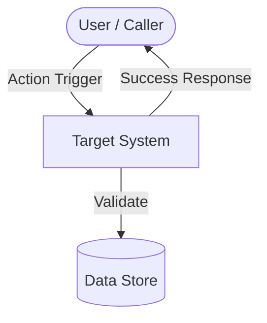

# Requirements Specification: <Feature Name>

<!--
Guidelines:
1. All functional requirements MUST use standard EARS patterns combined with uppercase RFC 2119/8174 keywords (MUST, MUST NOT, SHOULD, MAY).
2. Adhere to ISO/IEC/IEEE 29148:2018 quality characteristics: Unambiguous, Complete, Consistent, Verifiable, and Traceable.
3. Include visual Mermaid modeling for human readability.
4. If translating to a localized file (e.g. *.<lang>.md like *.ja.md, *.fr.md), translate accurately using standard RFC 2119 mapping after English SSOT approval.
-->

## 1. Context & Motivation

### 1.1 Problem Statement
<Describe the core problem, user pain points, and why this initiative is necessary.>

### 1.2 Business & Technical Goals
- <Goal 1: Measurable outcome or capability delivered>
- <Goal 2: Architectural or operational improvement>

### 1.3 Target Personas & Stakeholders
- **<Persona/Role 1>**: <Description and expectations>
- **<System Actor 2>**: <External service or subsystem interacting with this feature>

---

## 2. User Scenarios & Use Cases

### 2.1 Use Case 1: <Use Case Title>
- **Actor**: <Primary actor or initiating service>
- **Preconditions**: <System state or prerequisites required before execution>
- **Trigger**: <Event that initiates the use case>
- **Basic Flow**:
  1. <Step 1: Actor action>
  2. <Step 2: System response or processing>
  3. <Step 3: Successful completion outcome>
- **Alternative Flows**:
  - <Alternative condition and deviation flow>
- **Exception Flows**:
  - <Error or boundary condition and system recovery behavior>
- **Postconditions**: <Guaranteed system state upon successful completion>

---

## 3. Visual Modeling

---

## 4. Functional Requirements

All functional requirements are defined using standard EARS patterns and uppercase RFC 2119 / RFC 8174 keywords.

| Requirement ID | EARS Pattern Type | Specification Statement (RFC 2119 / 8174) | Verification Method |
| :--- | :--- | :--- | :--- |
| **REQ-001** | Ubiquitous | The system MUST <action / property>. | Automated Test |
| **REQ-002** | Event-driven | When <trigger>, the system MUST <action>. | Integration Test |
| **REQ-003** | State-driven | While <in state>, the system MUST <action>. | Automated Test |
| **REQ-004** | Unwanted Behavior | If <error condition>, then the system MUST <error handling action> and MUST NOT <undesired side effect>. | Unit / Fault Test |
| **REQ-005** | Optional Feature | Where <optional feature is enabled>, the system MAY <optional action>. | Integration Test |
| **REQ-006** | Complex | While <state>, when <trigger>, the system MUST <action>. | Scenario Test |

<!--
On revisions:
- Existing IDs MUST NOT be changed or renumbered.
- Obsolete requirements MUST be marked as `[DEPRECATED]` with rationale rather than deleted.
- New requirements MUST receive sequential incremental IDs.
-->

---

## 5. Non-Functional Requirements

- **NFR-PERF-001 (Performance)**: The system MUST process operations within <threshold, e.g. 200ms>.
- **NFR-SEC-001 (Security)**: The system MUST validate all inputs and MUST NOT leak sensitive data.
- **NFR-COMP-001 (Compatibility)**: The system MUST maintain compatibility with <runtime/dependencies>.
- **NFR-REL-001 (Reliability)**: The system MUST fail safely (Fail-Closed) in the event of unexpected exceptions.

---

## 6. Out of Scope

The following items are explicitly excluded from this specification:
- <Item 1: Capability deliberately deferred to future phases>
- <Item 2: Out-of-boundary integration or platform variation>

